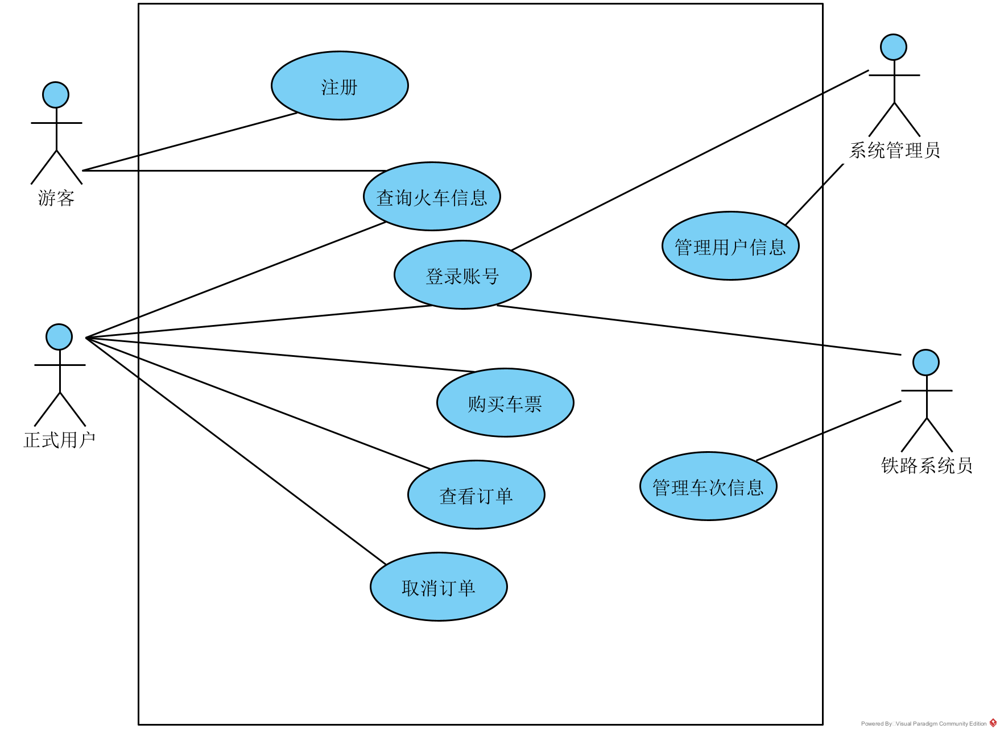
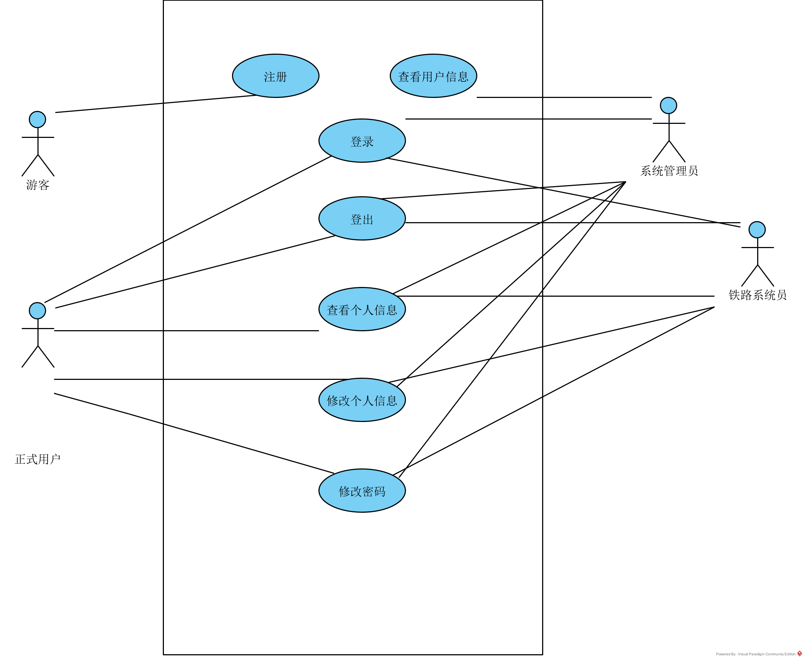
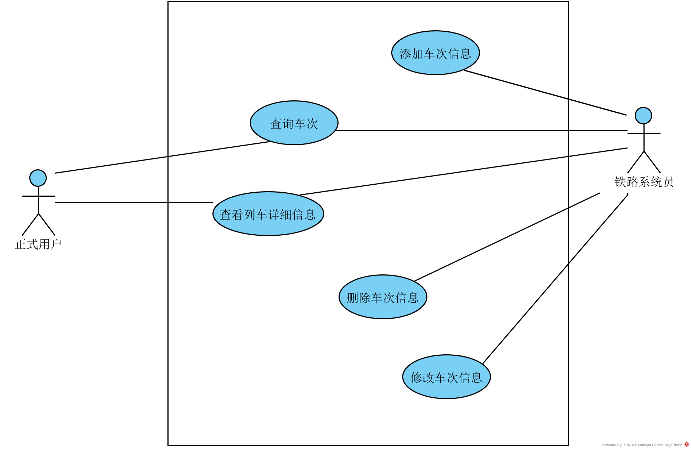
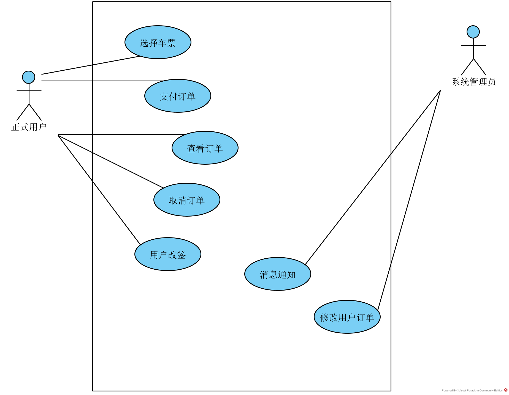
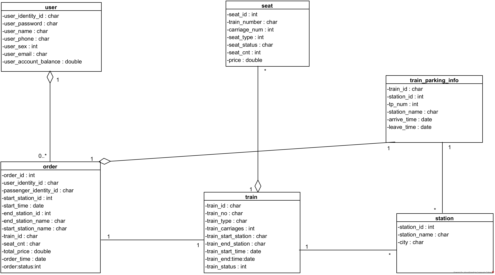
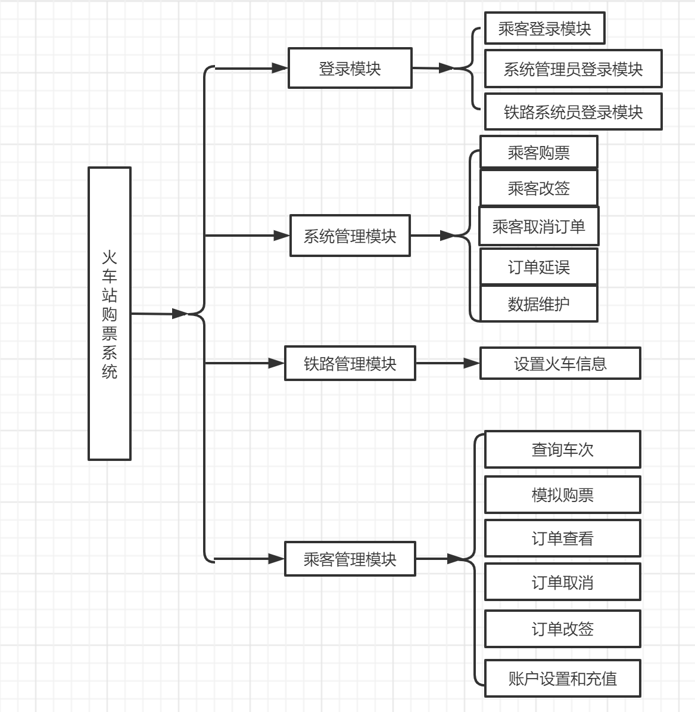
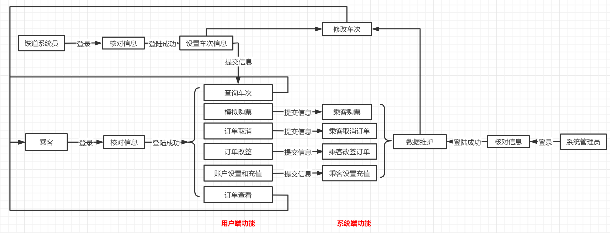

# 21306 Train Website 火车购票系统 需求规格说明书

## 目录
火车购票系统	1  
1.引言	2  
1.1编写目的	2  
1.2编写依据	2  
1.3涉及名词	2  
2.软件概要	3  
2.1软件总体描述	3  
2.2软件设计约束及有关说明	3  
2.3使用者特点	3  
3.系统功能需求	4  
3.3 数据流分析	5  
3.4 数据字典	6  
3.5. ER图	8  
4.软硬件及外部系统接口需求	11  
4.1 用户界面	11  
4.2 硬件需求	12  
4.3 运行环境	12  
5.可靠性与可用性需求	12  
5.1 性能需求	12  
5.2 安全性需求	12  
6.参考文献	13  

## 1.引言
### 1.1. 编写目的
编写此文档的目的是细化软件开发工作中的问题与概念，使软件开发、测试人员以及用户能够对本软件的需求与功能形成统一的认识。本文档说明了火车购票系统的各项功能需求、性能需求和数据需求，明确标识各项功能的具体含义，阐述实用背景及范围，表明了用户需要对于这些需求的满足与对功能的使用方法，提供统一的运行与调试标准。  
总而言之，本文档将为火车购票系统规定其设计总体要求，作为软件开发、测试人员进行软件管理的执行出发点。同时，本文件将记录功能、性能要求，数据结构和采集要求，重要的接口要求，作为软件设计人员进行概要设计的依据。最后，本文件将汇总软件的运行环境、条件、要求，作为软件确认测试的依据。  

### 1.2. 编写依据
依据火车购票系统的《软件项目计划书》编写。  

### 1.3. 涉及名词
[1] 系统管理员：本系统的后台管理者，管理所有用户信息以及用户账户信息。    
[2] 铁路系统员：本系统后台管理者，管理所有火车铁路信息。    
[3] 游客：本平台未注册用户，可以进行火车票的查询。    
[4] 正式用户：本平台已注册的用户，可以执行火车票查询，订购等操作。    

## 2.软件概要
### 2.1. 软件总体描述
火车购票系统为方便旅客线上购票的需求而进行设计的网站，该系统至少包括用户注册、用户账户设置、系统管理员设置、铁路系统员、用户查询火车车次、用户购票、用户订单查看、用户取消订单、用户改签等功能。

### 2.2. 软件设计约束及有关说明
开发环境：  
操作系统：Windows10/Windows11   
数据库系统：MySQL-8.0.31  
IDE：JetBrains IntelliJ IDEA 2022.3.1 / Visual Studio Code 1.56.0  
测试工具：Postman等  
浏览器：Chrome  
编程语言：后端使用Java  
遵循的规范：软件的设计和开发过程需要严格按照软件的设计方案来进行。 
 软件开发过程应遵循软件工程规范，对过程和版本进行管理和控制。  
软件交付形式：可执行文档  
软件交付日期：校历第15周  

### 2.3. 使用者特点
本软件主要面对火车购票市场，使用者包括：  
系统管理员：是本系统的后台管理者，管理所有用户信息以及用户账户信息；  
铁路系统员：后台管理者：管理所有火车铁路信息；  
游客：本平台未注册用户，可以进行火车票的查询；  
正式用户：本平台已注册的用户，可以执行火车票查询，订购等操作。  
系统管理员与铁路系统员需经过计算机操作的培训，有基础的计算机知识。游客与用户需有使用网页的能力。  

## 3.系统功能需求
### 3.1. 功能总览
|功能 |	具体描述 | 可使用此功能的系统角色 |
| :--: | :--: | :--: |
|用户注册 | 完成用户注册已经个人资料编辑 | 乘客 铁路系统员 系统管理员 |
| 用户账户设置 | 用户可以开通多个账户并具有充值功能来完成后续购票功能 | 乘客 |
| 系统管理员设置 | 系统管理员可以管理所有用户信息以及用户账户信息 | 系统管理员 |
| 铁路系统员 | 为铁路系统设置火车铁路运行车次，括该车次的火车信息、起始火车站台以及沿途的火车站台信息、火车不同的座位信息、发车日期时间以及到各个站台的时间，同时保证不为同一趟车次创建不同的火车信息 | 铁路系统员 |
| 用户查询火车车次 | 用户输入起点终点以及乘坐日期，返回该天所有能满足用户需求的车次信息，包括起始点满足以及沿途的火车站台也能满足 | 乘客 |
|用户购票 | 进入主界面后输入起始城市、目的地城市和日期，选择行程和座位类型，选择或添加一个联系人完成预定后可以选择直接支付，也可以在订单列表中找到你之前预订的票并点击支付按钮 | 乘客 |
| 用户订单查看 | 用户可以在自己的订单列表中查看所有的已完成和未完成的订单，可以删除过期的订单或未支付的订单 | 乘客 |
| 用户取消订单 | 用户可以在订单中心取消距离发车时间一个小时的订单退钱 | 乘客 |
| 用户改签 | 用户可以选择改签（改签的起始点需一致）然后计算差价退还或支付额外的价钱，改签的新时间不能超过原始的24小时 | 乘客 |
| 消息通知 | 在用户购票、改签以及取消订单后系统会自动发消息通知用户 | 系统管理员 |
| 车次取消或者延误 | 因紧急情况工作人员修改车次或者取消车次后通知所有购票的用户并且修改他们的订单信息，并提供用户免费改签的机会 | 系统管理员 | 
| 模拟购票 | 用户的购票支付都是模拟线上系统的 | 乘客 |

### 3.2. 用户故事
1. 作为游客，我想完成注册，从而获得个人账号，填写个人信息。
2. 作为用户，我想完成登录，从而进入个人的账号。
3. 作为用户，我想完成充值，从而使账号中有余额用于购票。
4. 作为用户，我想查询火车车次，从而查看满足要求的车票信息。
5. 作为用户，我想创建订单，从而预订选择好的火车票并添加到待支付订单中。
6. 作为用户，我想查看订单，从而浏览自己所有已完成和未完成的订单。
7. 作为用户，我想支付订单，从而完成购票。
8. 作为用户，我想删除订单，从而去掉那些已过期或未支付且不想支付的订单。
9. 作为用户，我想取消订单，从而在距离发车时间1小时之前退票并退钱。
10. 作为用户，我想改签，从而选择新的车次。
11. 作为系统管理员，我想查看和修改所有注册用户的信息和用户账户信息，从而管理用户。
12. 作为铁路系统员，我想查看和修改所有火车铁路的运行车次，从而管理火车。

### 3.3. 交互流程
1. 作为游客，我想完成注册，从而获得个人账号，填写个人信息。
基本流程 {
（用户）1. 游客点击注册按钮。
（系统）2. 前端申请注册界面的网页，并渲染在浏览器上。
（用户）3. 游客在注册界面输入个人的基本信息，包括身份证号、密码等。
（系统）4. 系统应检查游客输入的信息是否合法，比如两次密码是否一致、日期是否合法等。
（循环3 ~ 4 直到所有信息都得到合法的输入）
（用户）5. 游客点击“完成注册”按钮。
（系统）6. 前端将数据以json等形式发送给后端，并储存在数据库中，从而完成注册。
}

2. 作为用户，我想完成登录，从而进入个人的账号。
基本流程 {
（用户）1. 游客点击登录按钮。
（系统）2. 前端申请登录界面的网页，并渲染在浏览器上。
（用户）3. 游客在注册界面输入个人的基本信息，包括身份证号、密码等，并点击登录按钮。
（系统）4. 系统比对游客输入的信息是否在已注册的用户信息中，如果不在则报错。
（循环3 ~ 4 直到成功登录）
（系统）5. 系统给出提示“成功登录”。
}

3. 作为用户，我想完成充值，从而使账号中有余额用于购票。
基本流程 {
（用户）1. 用户点击充值按钮。
（系统）2. 前端申请充值界面的网页，并渲染在浏览器上。
（用户）3. 用户在充值界面输入想要充值的金额，并完成模拟的充值流程。
（系统）4. 系统应检查游客输入的充值是否合法。
（循环3 ~ 4 直到所有信息都得到合法的充值金额）
（系统）5. 将用户充入的金额添加到个人账户中。
}

4. 作为用户，我想查询火车车次，从而查看满足要求的车票信息。
基本流程 {
（用户）1. 用户输入起点、终点以及乘坐日期，并点击查询按钮。
（系统）2. 前端将用户输入的查询条件传给后端。
（系统）3. 后端根据查询条件从数据库中选择出所有合法的车次信息，包括起点满足且沿途车站满足的所有车次，并返回给前端。
（系统）4. 前端将满足要求的车次信息渲染到界面上，以供用户选择。
}
扩展流程 {
（可选） 1a. 用户可以使用高级需求查询功能：
        （用户） 1. 用户点击高级需求按钮，并输入高级需求，比如最便宜、最快车次。
        （系统） 2. 系统根据高级需求完成查询。
}

5. 作为用户，我想创建订单，从而预订选择好的火车票并添加到待支付订单中。
基本流程 {
（用户）1. 用户选择具体的车次和座位。
（用户）2. 用户选择或添加联系人，并提交订单。
（系统）3. 系统将订单添加到该用户的订单列表中。
}
扩展流程 {
（可选） 3a. 用户可以选择立刻支付刚刚创建的订单：
        （用户） 1. 用户点击立即支付按钮。
        （系统） 2. 系统自动跳转到支付订单的流程。
}

6. 作为用户，我想查看订单，从而浏览自己所有已完成和未完成的订单。
基本流程 {
（用户）1. 用户点击查看订单按钮。
（系统）2. 系统从数据库中查询该用户的所有订单信息，包括订单号、车次信息、总金额、订单状态等，并传给前端。
（系统）3. 前端将数据渲染在查看信息的界面上。
}

7. 作为用户，我想支付订单，从而完成购票。
基本流程 {
（用户）1. 用户选择某个订单，并选择支付。
（系统）2. 系统从数据库中查询该订单的信息，判断该订单是否仍处于待支付的状态，如果不是则报错。
（系统）3. 前端将订单数据渲染在查看信息的界面上，以供用户确认。
（用户）4. 用户确认订单信息，并支付。
（系统）5. 系统从用户的账户余额中扣除相应金额，并完成支付。
（系统）6. 系统发送消息通知用户成功购票。
}

8. 作为用户，我想删除订单，从而去掉那些已过期或未支付且不想支付的订单。
基本流程 {
（用户）1. 用户选择某个订单，并选择删除订单。
（系统）2. 系统从数据库中查询该订单的信息，判断该订单是否仍处于可删除的状态，如果不是则报错。
（系统）3. 前端将订单数据渲染在查看信息的界面上，以供用户确认。
（用户）4. 用户确认删除订单。
（系统）5. 系统将该订单标记为“已失效”状态，并完成删除订单。
}

9. 作为用户，我想取消订单，从而在距离发车时间1小时之前退票并退钱。
基本流程 {
（用户）1. 用户选择某个订单，并选择取消订单。
（系统）2. 系统从数据库中查询该订单的信息，判断该订单是否仍处于可取消的状态，如果不是则报错。
（系统）3. 前端将订单数据渲染在查看信息的界面上，以供用户确认。
（用户）4. 用户确认取消订单。
（系统）5. 系统将该订单标记为“已失效”状态，并将对应的金额添加到用户账号中。
}

10.  作为用户，我想改签，从而选择新的车次。
基本流程 {
（用户）1. 用户选择某个订单，并选择改签。
（系统）2. 系统查询地点和终点一致且发车时间在原车次24小时以内的车次信息，并渲染在界面上。
（用户）3. 用户选择新的车次。
（系统）4. 系统计算差价，并退还或通知用户支付额外的价钱。
（用户）5. 用户完成接收或付款，从而完成改签。
}

11. 作为系统管理员，我想查看和修改所有注册用户的信息和用户账户信息，从而管理用户。
基本流程 {
（用户）1. 系统管理员进入管理员界面
（系统）2. 系统查询所有用户信息，并渲染到界面上。
（用户）3. 系统管理员查看用户信息，或修改，从而管理用户。
}

12. 作为铁路系统员，我想查看和修改所有火车铁路的运行车次，从而管理火车。
基本流程 {
（用户）1. 铁路系统员进入管理员界面
（系统）2. 系统查询所有车次信息，并渲染到界面上。
（用户）3. 铁路系统员查看车次信息，或修改，从而管理车次。
}

### 3.4. 用例图
#### 3.4.1. 系统总用例图

#### 3.4.2. 用户子系统用例图

#### 3.4.3. 火车车次子系统用例图

#### 3.4.4. 订单子系统用例图

### 3.5. 概念类图

 
### 3.6. 业务流程
该系统是为方便旅客线上购票的需求而进行设计，主要功能是实现一个火车站的线上预、购票以及各种服务，系统管理员通过对用户数据的维护和通知来实现火车站的线上服务，而用户通过购买、改签等操作来实现线上的火车购票系统。  

### 3.7. 活动图
乘客登陆系统，在系统中查询车次，然后进行购票、订单查看、订单取消、订单改签等操作，然后提交给系统来实现乘客的购票、取消和改签并由系统管理员进行对数据进行维护和更新。

 
### 3.8. 数据字典
#### 3.8.1. user
user保存注册系统的用户的信息，主码为用户身份证号，用来作为每一个用户的唯一标记，同时身份证号也作为登录系统的用户名来使用。其中存在用户自定义的完整性约束：性别（0为女性，1为男性）。

| 字段名 | 数据类型 | 备注 | 允许为空 | 键 |
| :--: | :--: | :--: | :--: | :--: |
| user_identity_id | varchar(20) | 用户身份证号 | NO | 主键 |
| user_password | varchar(20) | 用户密码 | NO | |
| user_name | varchar(20) | 用户姓名 | NO | |	
| user_phone | varchar(20) | 用户手机号 | NO | |	
| user_sex | int | 用户性别(0为女性，1为男性) | NO | |	
| user_email | varchar(20) | 用户邮箱 | NO | |	
| user_account_balace | decimal(10, 2) | 用户账户余额 | NO | |

#### 3.8.2. train
train存储了车次的信息，车次号作为主键，用来作为每趟车次的唯一标记。每个每一趟列车都有一条自己的总的列车信息，包括列车编号、类型、车厢数、始发站和终点站，以及发车和到达时间。同时，车次信息还包括一个用户自定义的完整性约束：列车状态（0为正常，1为延误，2为取消）。
| 字段名 | 数据类型 | 备注 | 允许为空 | 键 |
| :--: | :--: | :--: | :--: | :--: |
| train_id | varchar(20) | 车次号 | NO | 主键 |
| train_no | varchar(20) | 列车编号 | NO | |	
| train_type | varchar(20) | 列车类型 | NO | |	
| train_carriages | int | 列车车厢数 | NO | |
| train_start_station | varchar(20) | 列车始发站 | NO | |	
| train_end_station | varchar(20) | 列车终点站 | NO | |	
| train_start_time | date | 列车开车时间 | NO | |
| train_end_time | date | 列车到达时间 | NO | |	
| train_status | int | 列车状态（0：正常，1：延误，2：取消） | NO | |	

#### 3.8.3. seat
seat为列车座位信息表，用座位编号、车次和车厢号共同作为主键，来唯一标识每一个座位。seat储存了该座位的类型、在每个到站区间是否售出、剩余量以及座位单价。其中，存在用户自定义的完整性约束：列车状态（0为头等座，1为一等座，2为二等座，3为硬卧，4为软卧）。
| 字段名 | 数据类型 | 备注 | 允许为空 | 键 |
| :--: | :--: | :--: | :--: | :--: |
| seat_id | int | 座位编号 | NO | 主键 |
| train_number | varchar(20) | 车次 | NO | 主键 |
| carriage_num | int | 车厢号 | NO | 主键 |
| seat_type | int | 座位类型（0：头等，1：一等，2：二等，3：硬卧，4：软卧） | NO |	
| seat_status | varchar(20) | 座位状态 假如首发站是第0站，终点站是第n-1站，则seat_status[i]表示第i站到第i+1站之间该座位是否售出 | NO |
| seat_cnt | int | 座位剩余量 优先出剩余量少的票 | NO |
| price | decimal(10, 2) | 座位单价 | NO |	

#### 3.8.4. station
station为站点信息表，以站点id作为主键，还储存了站点名称和所在城市。
| 字段名 | 数据类型 | 备注 | 允许为空 | 键 |
| :--: | :--: | :--: | :--: | :--: |
| station_id	| int	| 站点id	| NO	| 主键| 
| station_name	| varchar(20)	| 站点名称	| NO	|
| city	| varchar(20)	| 所在城市	| NO	|

#### 3.8.5. train_parking_info
train_parking_info为列车的经停信息表，以车次和站点id作为主键，以唯一标识每个停靠站点。储存了停靠信息，包括站点名称、到站时间和发车时间等。
| 字段名	| 数据类型	| 备注	| 允许为空	| 键|
| :--: | :--: | :--: | :--: | :--: |
| train_id	| varchar(20)	| 车次	| NO	| 主键 |
| station_id	| int	| 站点id	| NO	| 主键 |
| tp_num	| int	| 该站是起始车站起停靠的第几站，起始车站为0，终点站为n-1	| NO	|
| station_name	| varchar(20)	| 站点名称	| NO	| 
| arrive_time	| date	| 到站时间	| NO	| 
| leave_time	| date	| 发车时间	| NO |	

#### 3.8.6. order
order是订单信息。以订单id和用户身份证号作为主键，以唯一标识每个订单。订单信息储存了车次的相关信息和订单的相关属性，比如创建时间，总价格等等。其中，存在用户自定义的完整性约束：订单状态：（0：未支付，1：待支付，2：已失效）。
| 字段名	| 数据类型	| 备注	| 允许为空	| 键 |
| :--: | :--: | :--: | :--: | :--: | 
| order_id	| int	| 订单id	| NO	| 主键 |
| user_identity_id	| varchar(20)	| 用户身份证号	|NO	| 主键 | 
| passenger_identity_id	| varchar(20)	| 乘客身份证号 |	NO |	
| start_station_id	| int	| 起点id	| NO	|
| start_station_name	| varchar(20)	| 起点名称	| NO |	
| start_time	| date	| 开车时间	| NO	|
| end_station_id	| int	| 终点id	| NO	|
| end_station_name	| varchar(20)	| 终点名称 | 	NO |	
| end_time	| date	| 到站时间	| NO	|
| train_id	| varchar(20)	| 车次	| NO |	
| seat_cnt	| varchar(20)	| 座位编号(seat_cnt[i]表示该类型座位的购买数量)	 | NO |	
| total_price	| decimal(10, 2)	| 总价格	| NO	 |
| order_time	| date	| 订单创建时间	| NO	|
| order_status	| int	| 订单状态：0：未支付，1：待支付（在有效期内），2：已失效	| NO| 	

### 3.9. ER图
#### 3.9.1. 用户ER图

 
#### 3.9.2. 车次ER图

#### 3.9.3. 座位ER图

#### 3.9.4. 站点ER图

#### 3.9.5. 列车经停信息ER图

#### 3.9.6. 订单ER图

## 4.软硬件及外部系统接口需求
### 4.1. 用户界面
类似当前铁路售票网页，力图做到用户界面美观、操作简单、功能全面、异常处理完善的火车购票系统。
### 4.2. 硬件需求
服务器硬件配置要求：
主板：稳定，拥有较大带宽的总线。
硬盘：SATA级别以上。
CPU：P4级别以上。
内存：1GB以上。
网卡：使用专业级别的网卡。

服务器相关环境配置：
1.操作系统：Ubuntu 18.04
2.运行环境：Python 3.6
3.数据库：MySQL 5.0
4.前端框架：vue/cli 4.5.13
5.后端框架：Springboot 3.0.5

### 4.3. 运行环境
使用Google Chrome,Fire Fox,Edge等高效浏览器。

## 5.可靠性与可用性需求
### 5.1. 性能需求
系统对多用户同时访问、购票的并行处理能力应足够。若仍出现异常错误，应返回详细的错误提示，并取消用户可能的支付行为。在用户进行查询操作时，返回结果速度应尽可能快，以提高用户使用感受。因此，网页服务器需要较好的网络条件以及性能。
### 5.2. 安全性需求
本系统应严格控制访问权限，不同的用户具有不同的身份和权限，在用户身份真实可信的前提下，保护数据不被非法/越权访问和篡改，确保数据的机密性和完整性。此外，在支付界面也应该使用相应的安全协议，避免用户产生不必要的损失。
## 6. 参考文献
[1]GB/T 8567-2006, 计算机软件文档编制规范[S].2006.
[2]张海藩、牟永敏等.面向对象程序设计实用教程（第二版）[M]. 北京:清华大学出版社, 2007. 213-219.
