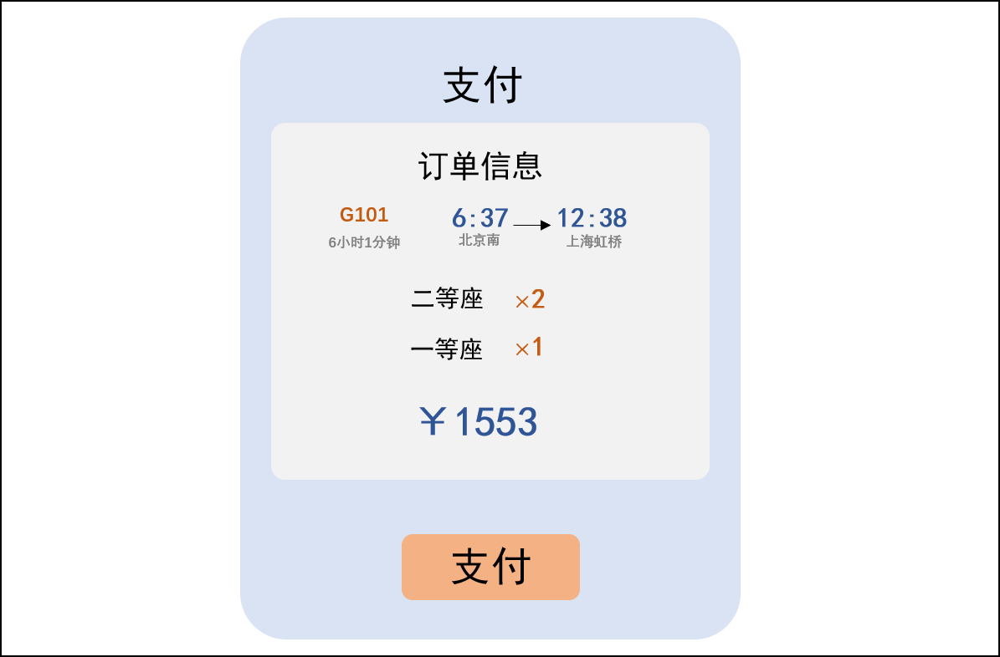

# 21306 Train Website 火车购票系统 软件设计说明书

## 1. 引言

### 1.1. 编写目的

编写此说明书的目的在于记录软件的详细设计信息，为开发人员、测试人员、维护人员、项目管理人员和客户或用户提供火车购票系统设计的详细说明。软件设计说明书中记录了火车购票系统的架构、模块划分、模块功能、模块之间的交互方式等详细的设计信息，以便各方了解该系统的功能、结构和实现细节。通过软件设计说明书，开发人员能够根据设计要求编写出符合要求的程序代码，测试人员能够准确地进行测试，维护人员能够更加方便地进行维护和升级，项目管理人员能够进行项目进度的跟踪和管理，客户或用户能够了解软件系统的功能和特性，从而更好地使用和维护火车购票系统。

### 1.2. 读者对象

- 开发人员：软件设计说明书是开发人员编写程序代码的重要依据，开发人员需要仔细阅读软件设计说明书，了解系统的功能、结构和实现细节，以便编写符合设计要求的程序代码。

- 测试人员：软件设计说明书提供了系统的设计细节，测试人员需要了解系统的结构和实现方式，以便准确地进行测试，保证软件质量。

- 维护人员：软件设计说明书记录了软件系统的详细设计信息，维护人员需要了解系统的结构和实现方式，以便更加方便地进行维护和升级。

- 项目管理人员：软件设计说明书提供项目开发的进度和成果，项目管理人员需要了解系统的设计和实现细节，以便进行项目进度的跟踪和管理。

- 用户：软件设计说明书向用户提供了系统设计的详细说明，包括系统的功能和特性，以便用户了解系统的功能和使用方式，从而更好地使用软件系统。

### 1.3. 软件系统概述

随着社会的迅速发展，火车成为了人们在交通方面不可缺少的交通工具。为了满足日益增长的火车乘坐需求，切合社会发展，研发了本火车购票系统。该软件系统是一个面向用户的购票网站，旨在为用户提供方便、快捷的火车票购买服务。该系统的主要用户群体是需要购买火车票的乘客以及管理者，系统的主要功能模块包括用户注册、用户账户设置、系统管理员设置、铁路系统员、用户查询火车车次、用户购票、用户订单查看、用户取消订单、用户改签等。系统的体系设计结构采用B/S架构，MVC模式。系统的前端基于vue框架，使用HTML、CSS、JavaScript等技术，后端采用Java语言和Springboot框架进行开发，数据库采用MySQL，运行环境为Google Chrome,Fire Fox,Edge等高效浏览器。

### 1.4. 文档概述

软件设计说明书主体框架由四部分组成，包括：引言、软件设计和原则、软件设计方案和实施指南。

本文档基于软件开发计划书、需求规格说明书，面向火车购票系统的开发人员、测试人员、项目管理人员等相关人员，同时也面向对该系统感兴趣或需要了解该系统的技术人员、用户等，旨在详细说明火车购票系统的软件设计，包括系统体系结构设计、用户界面设计、用例设计、子系统设计、类设计、数据设计、部署设计等方面的内容，为后续的编码、测试、运维等工作提供指导和依据。

### 1.5. 定义

- MySQL： 一种开源的关系型数据库管理系统，使用SQL语言进行数据管理和查询.

- Springboot:：基于Spring框架的开源Java应用程序开发工具，可快速构建可独立运行的Spring应用程序。

- Vue：一个轻量级的JavaScript框架，用于构建Web界面的用户界面库。

- Postman：API测试工具，可以帮助开发人员设计、测试和文档化API。

### 1.6. 参考资料

[1]GB/T 8567-2006, 计算机软件文档编制规范[S].2006.

  
## 2. 软件设计约束和原则

### 2.1. 软件设计约束

操作系统：Windows10/Windows11​ 
  
数据库系统：MySQL-8.0.31​ 
  
IDE：JetBrains IntelliJ IDEA 2022.3.1 / Visual Studio Code 1.56.0​ 
  
测试工具：Postman等​ 
  
浏览器：Chrome​ 
  
编程语言：后端采用Java语言​ 
  
性能：系统具备对多用户同时访问、购票的并行处理能力。系统出现异常错误时，应返回详细的错误提示，并取消用户可能的支付行为。在用户进行查询操作时，应具备高效返回结果，以提高用户使用感受。
  
安全性：严格控制访问权限，不同的用户具有不同的身份和权限，在用户身份真实可信的前提下，保护数据不被非法/越权访问和篡改，确保数据的机密性和完整性。此外，在支付界面也应该使用相应的安全协议，避免用户产生不必要的损失。
  
遵循的规范：软件的设计和开发过程需要严格按照软件的设计方案来进行。 软件开发过程应遵循软件工程规范，对过程和版本进行管理和控制。

### 2.2. 软件设计原则

- 单一职责原则(SRP)：在设计系统的各个模块时，应该将职责划分清晰，确保每个模块只负责一项功能。

- 开放封闭原则(OCP)：系统应该设计得可扩展，但不可修改。当需要添加新功能时，应该通过扩展已有的模块或添加新的模块来实现，而不是直接修改原有代码。这样可以避免影响系统稳定性，也便于代码的维护和复用。

- 里氏替换原则(LSP)：在设计系统的各个模块时，应该确保子类能够替换掉父类并且不会影响系统的正确性。

- 接口隔离原则(ISP)：系统应该设计良好的接口，不应该强迫客户端依赖于它们不使用的接口。

- 依赖倒置原则(DIP)：高层模块不应该依赖于低层模块，二者应该都依赖于抽象接口。
  
    
## 3. 软件设计方案

### 3.1. 体系结构设计

#### 3.1.1. B/S架构
软件的体系结构设计是指在一定的设计原则基础上，从不同角度对组成系统的各部分进行搭配和安排，形成系统的多个结构而组成架构。它包括该系统的各个组件，组件的外部可见属性及组件之间的相互关系。在设计火车购票系统时，为了帮助理解、评估和改进系统的质量、性能和可维护性，我们完成了火车购票系统的体系结构设计。  
  
21306TrainWebsite 火车购票系统采用B/S架构模式进行设计。B/S架构是一种软件开发的架构模式，也叫做浏览器/服务器结构。B/S架构的特点是客户端无需安装，只有Web浏览器即可，服务器端负责处理业务逻辑和数据存储，客户端和服务器端通过HTTP协议进行通信。  
  
B/S架构的优点是可以直接放在广域网上，方便用户访问和更新，交互性较强，部署简单；缺点是在跨浏览器、表现能力、速度和安全性上需要花费更多的设计成本。

#### 3.1.2. MVC模式
在具体实现上，21306TrainWebsite 火车购票系统客户端-服务器-数据库的结构，并采用MVC模式进行设计。系统架构包括以下3部分：
- 客户端：即用户使用的浏览器，可以发送HTTP请求，接收服务器响应，展示票务数据和购票交互界面。
- 服务器：即用于处理用户请求的计算机软件，包含Web服务层和应用层。Web服务层负责接收和解析HTTP请求，应用层负责调用业务逻辑，返回数据和视图。
- 数据库：指的是存储和管理数据的计算机软件，即MySql数据库。服务器可以通过SQL语句或其他方式与数据库进行数据交换。
  
客户端负责显示数据和接收用户输入，相当于MVC模式中的视图（View）。服务器是控制层，可以运用Servlet或其他技术来实现控制器（Controller），负责接收和处理用户请求，并调用模型（Model）来返回数据和视图。数据库是数据层，可以运用JavaBean或其他技术来实现模型（Model），负责封装数据和业务逻辑，并与数据库进行交互。

#### 3.1.3. 工作流程
- 用户通过浏览器向服务器发送请求，请求到达控制器。
- 控制器解析请求，调用相应的模型进行业务处理。
- 模型返回处理结果给控制器。
- 控制器根据结果选择合适的视图，并将数据传递给视图。
- 视图渲染数据，生成响应页面，返回给用户。

### 3.2. 用户界面设计

#### 3.2.1. 主界面

#### 3.2.2. 选座界面

#### 3.2.3. 注册/登录界面
##### 3.2.3.1. 登录界面

##### 3.2.3.2. 注册界面

#### 3.2.4. 个人订单界面

#### 3.2.5. 支付界面

#### 3.2.6. 系统管理员界面

#### 3.2.7. 铁道系统员界面

### 3.3. 用例设计

#### 3.3.1. 概述
用例视图用于描述系统的参与者与功能用例间的关系，反映系统的最终需求和交互设计。本节给出 21306TrainWebsite 火车购票系统的用例视图设计，确定系统的边界、用户、功能和场景。在UML中，用例视图通常由用例图描述。用例图由参与者、用例和它们之间的关系组成，包括系统总体用例图和各个关键子系统的用例图。

##### 3.3.2. 系统总体用例

### 3.4. 子系统/构件设计

#### 3.4.1. 概述
子系统设计是在完成系统功能结构设计后，对每个子系统进行详细的设计，包括子系统的功能、接口、数据结构、算法等。子系统设计的目的是将一个复杂的软件系统分解为若干个相对独立的、易于实现和维护的子系统，提高软件的模块化和可重用性。

#### 3.4.2. 子系统划分
根据系统功能结构图，将系统划分为若干个子系统，包括用户子系统、火车车次子系统、订单子系统、选座购票子系统和消息通知子系统。每个子系统负责一部分功能，具有一定的内聚性和低耦合性。
  
**用户子系统**：负责用户的注册、登录、信息修改和权限控制等功能。  
**火车车次子系统**：负责火车的时刻表、车次、座位、票价等信息的管理和查询功能。  
**订单子系统**：负责订单的创建、支付、取消、退款等功能。
**选座购票子系统**：负责添加联系人、乘客，根据车次和座位信息选择座位，并计算价格、生成订单。
**消息通知子系统**：负责在用户购票、改签以及取消订单等操作后发送消息通知用户。

#### 3.4.3. 子系统清单
本火车购票系统的子系统设置如下。
| 编号 | 名称 | 子系统功能描述 |
| :---: | :---: | :---: |
| 1 | 用户子系统 | 负责用户的注册、登录、信息修改和权限控制等功能 |
| 2 | 火车车次子系统 | 负责火车的时刻表、车次、座位、票价等信息的管理和查询功能 |
| 3 | 订单子系统 | 负责订单的创建、支付、取消、退款等功能 | 
| 4 | 选座购票子系统 | 负责添加联系人、乘客，根据车次和座位信息选择座位，并计算价格、生成订单 | 

#### 3.4.4. 子系统所包含的功能清单
|功能 |	具体描述 | 可使用此功能的系统角色 |
| :--: | :--: | :--: |
|用户注册 | 完成用户注册已经个人资料编辑 | 乘客 铁路系统员 系统管理员 |
| 用户账户设置 | 用户可以开通多个账户并具有充值功能来完成后续购票功能 | 乘客 |
| 系统管理员设置 | 系统管理员可以管理所有用户信息以及用户账户信息 | 系统管理员 |
| 铁路系统员 | 为铁路系统设置火车铁路运行车次，括该车次的火车信息、起始火车站台以及沿途的火车站台信息、火车不同的座位信息、发车日期时间以及到各个站台的时间，同时保证不为同一趟车次创建不同的火车信息 | 铁路系统员 |
| 用户查询火车车次 | 用户输入起点终点以及乘坐日期，返回该天所有能满足用户需求的车次信息，包括起始点满足以及沿途的火车站台也能满足 | 乘客 |
|用户购票 | 进入主界面后输入起始城市、目的地城市和日期，选择行程和座位类型，选择或添加一个联系人完成预定后可以选择直接支付，也可以在订单列表中找到你之前预订的票并点击支付按钮 | 乘客 |
| 用户订单查看 | 用户可以在自己的订单列表中查看所有的已完成和未完成的订单，可以删除过期的订单或未支付的订单 | 乘客 |
| 用户取消订单 | 用户可以在订单中心取消距离发车时间一个小时的订单退钱 | 乘客 |
| 用户改签 | 用户可以选择改签（改签的起始点需一致）然后计算差价退还或支付额外的价钱，改签的新时间不能超过原始的24小时 | 乘客 |
| 消息通知 | 在用户购票、改签以及取消订单后系统会自动发消息通知用户 | 系统管理员 |
| 车次取消或者延误 | 因紧急情况工作人员修改车次或者取消车次后通知所有购票的用户并且修改他们的订单信息，并提供用户免费改签的机会 | 系统管理员 | 
| 模拟购票 | 用户的购票支付都是模拟线上系统的 | 乘客 |
  

#### 3.4.5. 子系统的详细设计
##### 3.4.5.1. 用户子系统
以下是用户子系统的详细设计。
###### 3.4.5.1.1. 用户子系统用例图

###### 3.4.5.1.2. 用户子系统活动图
**注册活动图：**

  
**登录活动图：**

**用户管理活动图：**

###### 3.4.5.1.3. 用户子系统顺序图

**注册顺序图：**

**登录顺序图：**

**用户管理顺序图：**

##### 3.4.5.2. 火车车次子系统
以下是火车车次子系统的详细设计。

###### 3.4.5.2.1. 火车车次子系统用例图

###### 3.4.5.2.2. 火车车次子系统活动图
**车次查询活动图：**  

**高级车次查询活动图：**

**车次详细信息查询活动图：**

**铁路管理活动图**

###### 3.4.5.2.3. 火车车次子系统顺序图

**车次查询顺序图：**

**高级车次查询顺序图：**

**车次详细信息查询顺序图：**

**铁路管理员顺序图：**

##### 3.4.5.3. 订单子系统
以下是订单子系统的详细设计。
###### 3.4.5.2.1. 订单子系统用例图

###### 3.4.5.2.2. 订单子系统活动图
**创建订单活动图：**

**支付订单活动图：**

**取消订单活动图：**

**改签活动图：**

###### 3.4.5.2.3. 订单子系统顺序图
**创建订单顺序图：**

**支付订单顺序图：**

**取消订单顺序图：**

**改签顺序图：**

##### 3.4.5.4. 选座购票子系统
以下是选座购票子系统的详细设计。

###### 3.4.5.4.1. 选座购票子系统用例图

###### 3.4.5.4.2. 选座购票子系统活动图

#### 3.4.6. 子系统接口设计
确定每个子系统与其他子系统或外部环境之间的交互方式，包括输入输出数据、控制信号、通信协议等。
  
##### 3.4.6.1. 用户子系统的接口设计
###### 3.4.6.1.1. 查询用户信息接口
根据用户身份证 ID 查询用户信息。  
传入用户身份证 ID。  
返回用户的姓名、证件号码、手机号、邮箱信息。

###### 3.4.6.1.2. 新增用户信息接口
根据用户身份证 ID 查询用户信息。  
传入用户身份证 ID，以及用户姓名、手机号、邮箱。  
返回调用接口是否成功。

###### 3.4.6.1.3. 更改用户信息接口
根据用户身份证 ID 更改用户信息。  
传入用户身份证 ID，以及需要修改的字段。  
返回调用接口是否成功。

###### 3.4.6.1.4. 删除用户信息接口
根据用户身份证 ID 删除用户信息。  
传入用户身份证 ID。
返回调用接口是否成功。

###### 3.4.6.1.5. 用户充值接口
根据用户身份证 ID 进行充值。  
传入用户身份证 ID，以及想要充值的金额。
返回调用接口是否成功。

###### 3.4.6.1.6. 用户消费接口
根据用户身份证 ID 进行消费。  
传入用户身份证 ID，以及想要消费的金额。
返回调用接口是否成功。

##### 3.4.6.2. 火车车次子系统的接口设计

###### 3.4.6.2.1. 查询火车车次信息接口
根据火车车次id查询火车车次。
传入火车车次id。
返回火车车次信息，包括车次状态、始发站、终点站、开车时间、到达时间、停经站台、用户、座位等信息。

###### 3.4.6.2.2. 新增火车车次信息接口
根据火车车次id新增火车车次。
传入火车车次id，以及车次信息，包括车次状态、始发站、终点站、开车时间、到达时间、停经站台、用户、座位等信息。
返回调用接口是否成功。

###### 3.4.6.2.3. 更改火车车次信息接口
根据火车车次id更改火车车次。
传入火车车次id，以及想要修改的车次信息，包括车次状态、始发站、终点站、开车时间、到达时间、停经站台、用户、座位等信息。
返回调用接口是否成功。

###### 3.4.6.2.4. 删除火车车次信息接口
根据火车车次id删除火车车次。
传入火车车次id。
返回调用接口是否成功。

##### 3.4.6.3. 订单子系统的接口设计

###### 3.4.6.3.1. 查询订单接口
根据订单id查询订单信息。
传入订单的id。
返回订单信息，包括火车车次id，乘客id，座位id。

###### 3.4.6.3.2. 新建订单接口
根据订单id新建订单信息。
传入订单的id，以及订单信息，包括火车车次id，乘客id，座位id。
返回调用接口是否成功。

###### 3.4.6.3.3. 更改订单接口
根据订单id更改订单信息。
传入订单的id，以及需要修改的订单信息，包括火车车次id，乘客id，座位id。
返回调用接口是否成功。

###### 3.4.6.3.4. 删除订单接口
根据订单id删除订单信息。
传入订单的id。
返回调用接口是否成功。

  
#### 3.4.7. 子系统内部设计
对每个子系统进行进一步的分解和设计，包括模块划分、模块接口设计、模块内部设计等。

#### 3.4.8. 子系统测试设计
制定每个子系统的测试计划和测试用例，验证子系统的正确性和完整性。

### 3.5. 类设计

#### 3.5.1. 类设计概述
火车购票系统共包括8个实体类，分别是用户类、系统管理员类、铁道管理员类、火车类、座位类、站台类、火车到站信息类和订单类。  
  
以下是可以体现8个类及其关系的系统类图。  

#### 3.5.2. 类的详细设计
##### 3.5.2.1. 用户类
###### 类名：User
###### 属性：  
| 属性名 | 数据类型 | 备注 | 
| :--: | :--: | :--: | 
| id | Integer | 用户id | 
| password | String | 用户密码 | 
| name | String | 用户姓名 | 		
| balace | double | 用户账户余额 |
| email | String | 邮箱 | 
| orders | List | 与火车的多对多关系列表 |

所有属性的访问修饰符均为private.  

##### 3.5.2.2. 火车类
###### 类名：Train
###### 属性：
| 属性名 | 数据类型 | 备注 | 
| :--: | :--: | :--: | 
| id | Integer | 车次号 | 	
| status | Status | 车次状态（0：正常，1：延误，2：取消） | 	
| departure_station | String | 列车始发站 | 
| arrival_station | String | 列车终点站 | 
| departure_time | LocalDateTime | 列车开车时间 | 
| arrival_time | LocalDateTime | 列车到达时间 |
| schedules | List<Schedule> | 与站台的多对多关系列表 |
| orders | List<Orders> | 与用户的多对多关系列表 |
| seats | List<Seat> | 与座位的一对多关系列表 |

所有属性的访问修饰符均为private.  
  
##### 3.5.2.3. 座位类
###### 类名：Seat
###### 属性：
| 属性名 | 数据类型 | 备注 | 
| :--: | :--: | :--: | 
| id | Integer | 座位编号（为了方便，假设1列火车16节，第1节为头等，第2节为1等……） | 
| trainId | Integer | 车次 | 
| type | Type | 座位类型 | 
| state | State | 座位状态  | 
| price | double | 座位单价 |
  
所有属性的访问修饰符均为private.  
  
##### 3.5.4. 站点类
###### 类名：Platform
###### 属性：
| 属性名 | 数据类型 | 备注 | 
| :--: | :--: | :--: | 
| id | Integer | 站点id	| 
| name | String	| 站点名称 |
| schedules	| List<Schedule> | 与火车的多对多关系列表 |

所有属性的访问修饰符均为private.  
  
##### 3.5.5. 车次表类
###### 类名：Schedule
###### 属性：
| 属性名 | 数据类型 | 备注 | 
| :--: | :--: | :--: | 
| id | Integer | 车次表id	| 
| platformId | Integer	| 站点id |
| trainId | Integer | 火车id |
| reach_time | LocalDateTime | 到站时间 |
| leave_time | LocalDateTime | 离站时间 |
  
所有属性的访问修饰符均为private.  

##### 3.5.6. 订单类
###### 类名：Orders
###### 属性：
| 属性名 | 数据类型 | 备注 | 
| :--: | :--: | :--: | 
| id | Integer | 订单id	| 
| trainId | Integer	| 火车id |
| userId | Integer | 用户id |
| seatId | Integer | 座位id |

所有属性的访问修饰符均为private.  
  
### 3.6. 数据设计
以下是对21306 Train Website火车购票系统进行的数据设计，涉及的数据的结构、类型、存储方式和关系等。在数据设计的过程中，力图保证数据的完整性、一致性、安全性和高效性，以及满足软件系统的功能需求和性能需求。

#### 3.6.1. 数据库的表设计
| 编号 | 表名 | 简要说明 |
| :---: | :---: | :---: |
| 1 | user | 用户信息表 |
| 2 | train | 车次信息表 |
| 3 | seat | 座位信息表 |
| 4 | station | 站点信息表 |
| 5 | train_parking_info | 列车经停信息表 | 
| 6 | order | 订单信息表 |

#### 3.6.2. 表的整体设计

#### 3.6.3. 表的具体设计

##### 3.6.3.1. user
user保存注册系统的用户的信息，主码为用户身份证号，用来作为每一个用户的唯一标记，同时身份证号也作为登录系统的用户名来使用。其中存在用户自定义的完整性约束：性别（0为女性，1为男性）。
  
| 字段名 | 数据类型 | 备注 | 允许为空 | 键 |
| :--: | :--: | :--: | :--: | :--: |
| user_identity_id | varchar(20) | 用户身份证号 | NO | 主键 |
| user_password | varchar(20) | 用户密码 | NO | |
| user_name | varchar(20) | 用户姓名 | NO | |	
| user_phone | varchar(20) | 用户手机号 | NO | |	
| user_sex | int | 用户性别(0为女性，1为男性) | NO | |	
| user_email | varchar(20) | 用户邮箱 | NO | |	
| user_account_balace | decimal(10, 2) | 用户账户余额 | NO | |
  

##### 3.6.3.2. train
train存储了车次的信息，车次号作为主键，用来作为每趟车次的唯一标记。每个每一趟列车都有一条自己的总的列车信息，包括列车编号、类型、车厢数、始发站和终点站，以及发车和到达时间。同时，车次信息还包括一个用户自定义的完整性约束：列车状态（0为正常，1为延误，2为取消）。
    
| 字段名 | 数据类型 | 备注 | 允许为空 | 键 |
| :--: | :--: | :--: | :--: | :--: |
| train_id | varchar(20) | 车次号 | NO | 主键 |
| train_no | varchar(20) | 列车编号 | NO | |	
| train_type | varchar(20) | 列车类型 | NO | |	
| train_carriages | int | 列车车厢数 | NO | |
| train_start_station | varchar(20) | 列车始发站 | NO | |	
| train_end_station | varchar(20) | 列车终点站 | NO | |	
| train_start_time | date | 列车开车时间 | NO | |
| train_end_time | date | 列车到达时间 | NO | |	
| train_status | int | 列车状态（0：正常，1：延误，2：取消） | NO | |
  

  
##### 3.6.3.3. seat
seat为列车座位信息表，用座位编号、车次和车厢号共同作为主键，来唯一标识每一个座位。seat储存了该座位的类型、在每个到站区间是否售出、剩余量以及座位单价。其中，存在用户自定义的完整性约束：列车状态（0为头等座，1为一等座，2为二等座，3为硬卧，4为软卧）。
  
| 字段名 | 数据类型 | 备注 | 允许为空 | 键 |
| :--: | :--: | :--: | :--: | :--: |
| seat_id | int | 座位编号 | NO | 主键 |
| train_number | varchar(20) | 车次 | NO | 主键 |
| carriage_num | int | 车厢号 | NO | 主键 |
| seat_type | int | 座位类型（0：头等，1：一等，2：二等，3：硬卧，4：软卧） | NO |	
| seat_status | varchar(20) | 座位状态 假如首发站是第0站，终点站是第n-1站，则seat_status[i]表示第i站到第i+1站之间该座位是否售出 | NO |
| seat_cnt | int | 座位剩余量 优先出剩余量少的票 | NO |
| price | decimal(10, 2) | 座位单价 | NO |
  

##### 3.6.3.4. station
  
station为站点信息表，以站点id作为主键，还储存了站点名称和所在城市。
  
| 字段名 | 数据类型 | 备注 | 允许为空 | 键 |
| :--: | :--: | :--: | :--: | :--: |
|station_id	| int	| 站点id	| NO	| 主键| 
|station_name	| varchar(20)	| 站点名称	| NO	|
|city	| varchar(20)	| 所在城市	| NO	|
  

##### 3.6.3.5. train_parking_info
train_parking_info为列车的经停信息表，以车次和站点id作为主键，以唯一标识每个停靠站点。储存了停靠信息，包括站点名称、到站时间和发车时间等。
| 字段名	| 数据类型	| 备注	| 允许为空	| 键|
| :--: | :--: | :--: | :--: | :--: |
| train_id	| varchar(20)	| 车次	| NO	| 主键 |
| station_id	| int	| 站点id	| NO	| 主键 |
| tp_num	| int	| 该站是起始车站起停靠的第几站，起始车站为 0，终点站为 n-1	| NO	|
| station_name	| varchar(20)	| 站点名称	| NO	| 
| arrive_time	| date	| 到站时间	| NO	| 
| leave_time	| date	| 发车时间	| NO |	

##### 3.6.3.6. order
  
order是订单信息。以订单id和用户身份证号作为主键，以唯一标识每个订单。订单信息储存了车次的相关信息和订单的相关属性，比如创建时间，总价格等等。其中，存在用户自定义的完整性约束：订单状态：（0：未支付，1：待支付，2：已失效）。
  
| 字段名	| 数据类型	| 备注	| 允许为空	| 键 |
| :--: | :--: | :--: | :--: | :--: | 
| order_id	| int	| 订单id	| NO	| 主键 |
| user_identity_id	| varchar(20)	| 用户身份证号	|NO	| 主键 | 
| passenger_identity_id	| varchar(20)	| 乘客身份证号 |	NO |	
| start_station_id	| int	| 起点id	| NO	|
| start_station_name	| varchar(20)	| 起点名称	| NO |	
| start_time	| date	| 开车时间	| NO	|
| end_station_id	| int	| 终点id	| NO	|
| end_station_name	| varchar(20)	| 终点名称 | 	NO |	
| end_time	| date	| 到站时间	| NO	|
| train_id	| varchar(20)	| 车次	| NO |	
| seat_cnt	| varchar(20)	| 座位编号(seat_cnt[i]表示该类型座位的购买数量)	 | NO |	
| total_price	| decimal(10, 2)	| 总价格	| NO	 |
| order_time	| date	| 订单创建时间	| NO	|
| order_status	| int	| 订单状态：0：未支付，1：待支付（在有效期内），2：已失效  3：已支付| NO| 
  

### 3.7. 部署设计

数据库服务器：用于存储用户模块和火车模块的数据，包括用户信息、订单信息、火车信息等。需要安装MySQL关系型数据库软件，以及Redis等缓存软件。  
本小组准备选择阿里云或腾讯云等云服务商提供的云数据库（RDS或CDB），根据预估的数据量和读写比例选择合适的配置和数量。我们可以使用主从复制（Master-Slave）或读写分离（Read-Write Splitting）来提高数据库的可用性和性能。可以使用缓存（Cache）来减少数据库的压力和提高数据的访问速度。

## 4.实施指南

### 4.1. 阅读软件设计说明书
在开始实施前，所有项目成员应该仔细阅读软件设计说明书，以确保对系统的功能、架构、模块、接口和设计约束有充分的了解。

### 4.2. 搭建开发环境
根据软件设计说明书中给出的开发环境要求，搭建相应的开发环境。例如，安装必要的编译器、开发工具、数据库、服务器等。
  
### 4.3. 系统分析
根据软件设计说明书中的系统分析，明确系统的需求和功能，分析业务流程、数据结构、数据流等，对系统的问题和局限性进行分析。
  
### 4.4. 设计和编码
基于软件设计说明书中的架构和模块设计，进行程序设计和编码。设计和编码过程应该遵循规范化的流程和标准，包括代码风格、注释、文档等。
   
### 4.5. 测试和调试
根据软件设计说明书中的测试计划和测试用例，对系统进行全面测试和调试。测试应该覆盖所有的功能和异常情况，确保系统的稳定性和可靠性。
  
### 4.6. 部署和上线
根据软件设计说明书中的部署方案，将系统部署到生产环境中，进行上线。在上线前，需要进行全面的测试和验收，确保系统的质量和可用性。
  
### 4.7. 维护和升级
根据软件设计说明书中的维护和升级计划，及时进行系统的维护和升级。维护和升级过程中，需要遵循相应的规范和流程，确保系统的稳定性和可靠性。

### 4.8. 文档更新
在实施过程中，根据实际情况对软件设计说明书进行更新和修订，确保其与实际开发情况的一致性。

