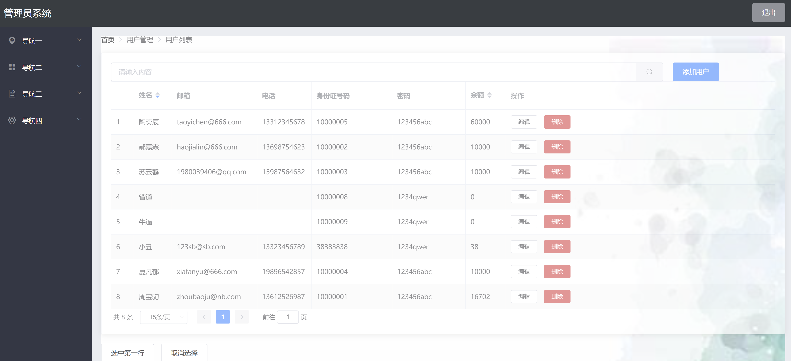
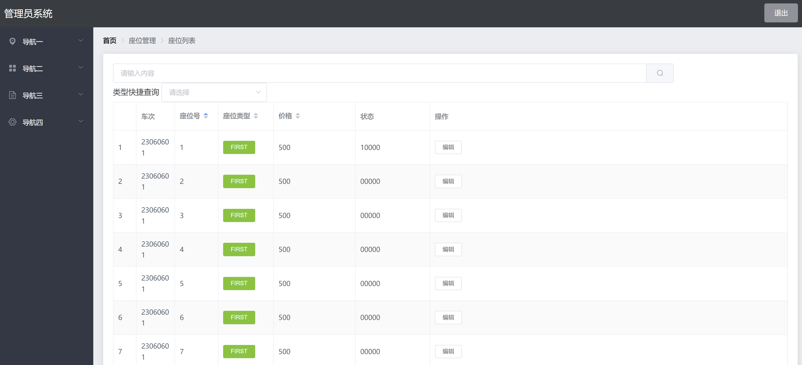

# 21306 Train Website 火车购票系统 软件实现说明书

苏云鹤 夏凡郁 周宝驹 陶奕宸 郝嘉霖

## 1. 引言

### 1.1 目的 

本软件实现说明书旨在介绍和指导火车购票系统的设计、开发和使用。该系统的主要目的是为用户提供一个便捷的方式来查询、购买、管理火车票，并提供灵活的改签和退票功能。通过这个系统，用户可以避免繁琐的实体购票流程，节省时间和精力，同时提高购票的准确性和便利性。本软件实现说明书将详细介绍系统的总体架构、功能描述、界面设计、数据库设计、部署和安装步骤、运行和使用说明等内容，旨在为开发人员和用户提供清晰的指导和参考。通过该说明书，开发人员可以根据需求进行系统的开发和测试，用户可以根据说明书来了解系统的使用方法，提高使用效率。

### 1.2 读者对象

- 开发人员：软件实现说明书让开发人员了解软件的基本实现方式，加深对于系统的运行理解从而能够更好的使用和维护系统
- 测试人员：软件实现说明书提供了系统的设计细节，测试人员需要了解系统的结构和实现方式以便准确地进行测试，保证软件质量
- 维护人员：软件实现说明书记录了软件系统的详细设计信息，维护人员了解系统的结构和实现方式以便更加方便地进行维护和升级
- 项目管理人员：软件实现说明书提供项目开发的成果，项目管理人员了解系统的设计和实现细节以便进行项目进度的跟踪和管理
- 用户：软件实现说明书向用户提供了系统实现的详细说明，包括系统的功能和特性，以便用户了解系统的功能和使用方式，从而更好地使用软件系统。

### 1.3 文档概述

软件实现说明书主体框架由如下部分组成包括：引言、总体描述、系统架构、功能描述、界面设计、数据库设计、部署和运行。

本文档基于软件开发计划书、需求规格说明书、软件设计说明书，面向火车购票系统的开发人员、测试人员、项目管理人员等相关人员，同时也面向对该系统感兴趣或需要了解该系统的技术人员、用户等，旨在详细说明火车购票系统的软件设计和使用，包括系统体系结构、用户界面、功能描述、部署和运行等方面的内容，为后续的编码、测试、运维等工作提供指导和依据

### 1.4 参考文献

[1]GB/T 8567-2006, 计算机软件文档编制规范[S].2006.


## 2.总体描述 

### 2.1 产品概述 

随着社会的迅速发展，火车成为了人们在交通方面不可缺少的交通工具。为了满足日益增长的火车乘坐需求，切合社会发展，研发了本火车购票系统。该软件系统是一个面向用户的购票网站，旨在为用户提供方便、快捷的火车票购买服务。该系统的主要用户群体是需要购买火车票的乘客以及管理者，系统的主要功能模块包括用户注册、用户账户设置、系统管理员设置、铁路系统员、用户查询火车车次、用户购票、用户订单查看、用户取消订单、用户改签等。系统的体系设计结构采用B/S架构，MVC模式。系统的前端基于vue框架，使用HTML、CSS、JavaScript等技术，后端采用Java语言和Springboot框架进行开发，数据库采用MySQL，运行环境为Google Chrome,Fire Fox,Edge等高效浏览器。

### 2.2 设计原则

- 单一职责原则(SRP)：在设计系统的各个模块时，应该将职责划分清晰，确保每个模块只负责一项功能。

- 开放封闭原则(OCP)：系统应该设计得可扩展，但不可修改。当需要添加新功能时，应该通过扩展已有的模块或添加新的模块来实现，而不是直接修改原有代码。这样可以避免影响系统稳定性，也便于代码的维护和复用。

- 里氏替换原则(LSP)：在设计系统的各个模块时，应该确保子类能够替换掉父类并且不会影响系统的正确性。

- 接口隔离原则(ISP)：系统应该设计良好的接口，不应该强迫客户端依赖于它们不使用的接口。

- 依赖倒置原则(DIP)：高层模块不应该依赖于低层模块，二者应该都依赖于抽象接口。

### 2.3 约束和限制 

操作系统：Windows10/Windows11​ 

数据库系统：MySQL-8.0.31​ 

IDE：JetBrains IntelliJ IDEA 2022.3.1 / Visual Studio Code 1.56.0​ 

测试工具：Postman等​ 

浏览器：Chrome​ 

编程语言：后端采用Java语言​ 

性能：系统具备对多用户同时访问、购票的并行处理能力。系统出现异常错误时，应返回详细的错误提示，并取消用户可能的支付行为。在用户进行查询操作时，应具备高效返回结果，以提高用户使用感受。

安全性：严格控制访问权限，不同的用户具有不同的身份和权限，在用户身份真实可信的前提下，保护数据不被非法/越权访问和篡改，确保数据的机密性和完整性。此外，在支付界面也应该使用相应的安全协议，避免用户产生不必要的损失。

遵循的规范：软件的设计和开发过程需要严格按照软件的设计方案来进行。 软件开发过程应遵循软件工程规范，对过程和版本进行管理和控制。


## 3.系统架构 

### 3.1 总体架构 

#### 3.1.1 B/S架构

软件的体系结构设计是指在一定的设计原则基础上，从不同角度对组成系统的各部分进行搭配和安排，形成系统的多个结构而组成架构。它包括该系统的各个组件，组件的外部可见属性及组件之间的相互关系。在设计火车购票系统时，为了帮助理解、评估和改进系统的质量、性能和可维护性，我们完成了火车购票系统的体系结构设计。  

21306TrainWebsite 火车购票系统采用B/S架构模式进行设计。B/S架构是一种软件开发的架构模式，也叫做浏览器/服务器结构。B/S架构的特点是客户端无需安装，只有Web浏览器即可，服务器端负责处理业务逻辑和数据存储，客户端和服务器端通过HTTP协议进行通信。  

B/S架构的优点是可以直接放在广域网上，方便用户访问和更新，交互性较强，部署简单；缺点是在跨浏览器、表现能力、速度和安全性上需要花费更多的设计成本。

#### 3.1.2 MVC模式

在具体实现上，21306TrainWebsite 火车购票系统客户端-服务器-数据库的结构，并采用MVC模式进行设计。系统架构包括以下3部分：

- 客户端：即用户使用的浏览器，可以发送HTTP请求，接收服务器响应，展示票务数据和购票交互界面。
- 服务器：即用于处理用户请求的计算机软件，包含Web服务层和应用层。Web服务层负责接收和解析HTTP请求，应用层负责调用业务逻辑，返回数据和视图。
- 数据库：指的是存储和管理数据的计算机软件，即MySql数据库。服务器可以通过SQL语句或其他方式与数据库进行数据交换。

客户端负责显示数据和接收用户输入，相当于MVC模式中的视图（View）。服务器是控制层，可以运用Servlet或其他技术来实现控制器（Controller），负责接收和处理用户请求，并调用模型（Model）来返回数据和视图。数据库是数据层，可以运用JavaBean或其他技术来实现模型（Model），负责封装数据和业务逻辑，并与数据库进行交互。

#### 3.1.3 工作流程

- 用户通过浏览器向服务器发送请求，请求到达控制器。
- 控制器解析请求，调用相应的模型进行业务处理。
- 模型返回处理结果给控制器。
- 控制器根据结果选择合适的视图，并将数据传递给视图。
- 视图渲染数据，生成响应页面，返回给用户。

#### 3.1.4 模块描述 

使用了单一模块的开发，模块trainWebsite也就是最终实现功能的模块


### 3.2 结构描述

#### 3.2.1 总体结构描述

使用了传统的springboot项目结构，继承了spingboot、mybatisPlus和springMVC开发的SSM架构，在java.com.example.trainWebsite包下包含了：

1. 配置类包：config
2. 结果封装类包：common
3. 控制层包：controller
4. 实体层包：domain
5. 数据层包：dao
6. 业务层包：service
7. springboot application类：TrainWebsiteApplication


#### 3.2.2 主体类架构描述

本项目为了实现最终效果，每一层都创建了不同的接口和类如下：

1. 数据层(domain)：

   * 用户类：User 表示所有使用该系统的用户的性质
   * 订单类：Orders 表示所有用户购买车票创建订单的性质
   * 座位类：Seat 表示所有火车上座位的性质
   * 火车类：Train 表示所有火车的性质
   * 消息类：Message 表示完成特定操作后发送消息的性质
   * 站台类：Platform 表示所有站台的性质
   * 车程表类：Schedule 表示火车和站台之间发车关系的表的性质
   * 支付请求类：PayRequirement 表示一个请求支付的信息
   * 用户管理员类：UserAdmin 表示用户管理员
   * 铁路管理员类：TrainAdmin 表示铁路管理员

   

2. 业务层(Service)：

   * 用户业务：UserService&UserServiceImpl 用户相关业务如充值
   * 火车业务：TrainService&TrainServiceImpl 火车相关业务如查询车次
   * 座位业务：SeatService&SeatServiceImpl 座位相关业务如选座
   * 订单业务：OrdersSerive&OrdersServiceImpl 订单相关业务如添加订单
   * 车程表业务：ScheduleService&ScheduleServiceImpl 车程相关业务如查询经停站
   * 用户管理员业务：UserAdminService&UserAdminServiceImpl 用户管理员相关业务如管理用户
   * 铁道管理员业务：TrainAdminSerive&TrainAdminServiceImpl 铁道管理员相关业务如添加车次

   

3. 控制层(controller)：

   * 用户控制层：UserController 
   * 火车控制层：TrainController
   * 座位控制层：SeatController
   * 订单控制层：OrdersController
   * 车程表控制层：ScheduleController
   * 用户管理员控制层：UserAdminController
   * 火车管理员控制层：TrainAdminController


### 3.3 接口描述

#### 3.3.1 控制层接口

1. 用户控制层接口

   * 获取所有用户信息：getAll()

     ```java
     public R getAll() {
             return userService.getAllUser();
         }
     ```

   * 获取指定用户信息：getUser()

     ```java
     @GetMapping("/oneUser")
         public R getUser(@RequestParam("id") Integer id)  {
             return userService.getUserById(id);
         }
     ```

   * 用户登录：login()

     ```java
      @GetMapping("/users/login")
         public R login(@RequestParam("id") Integer id, @RequestParam("password") String password) {
             return userService.login(id, password);
         }
     ```

   * CRUD操作(实现用户的增删改)：save()&delete()&update()

     ```java
     @PostMapping("/users/add")
         public R save(@RequestBody User user) {
             return userService.addUser(user);
         }
         @DeleteMapping("/users/delete")
         public R delete(@RequestParam("id") Integer id) {
             return userService.deleteUserById(id);
         }
     
         // 修改用户信息
         @PutMapping("/users/update")
         public R update(@RequestBody User user) {return userService.updateUser(user);}

   * 使用给定条件对用户进行模糊查询：fuzzySearch()

     ```java
     @GetMapping("/users/fuzzySearch")
         public R fuzzySearch(@RequestParam("condition") String condition) {
             return userService.fuzzySearch(condition);
         }

   * 用户充值：recharge()

     ```java
     @PutMapping("/users/recharge")
         public R recharge(@RequestBody PayRequirement payRequirement) {
             return userService.rechargeUserById(payRequirement.getUserId(), payRequirement.getPayNum());
         }

   * 用户获取消息：getMessage()

     ```java
     @GetMapping("/users/message/{id}")
         public R getMessage(@PathVariable Integer id) {
             return userService.getMessageById(id);
         }
     ```

     

2. 座位控制层接口

   * 改变座位价格：changeSeatPrice()

     ```java
     @PutMapping("/seat/change")
         public R changeSeatPrice(@RequestParam("trainId") Integer trainId,
                                  @RequestParam("seatId") Integer seatId,
                                  @RequestParam("price") Integer price,
                                  @RequestParam("type") SeatType seatType) {
             return null;
         }
     ```

   * 根据不同条件查询座位：searchSeatById()&searchSeatByType()&searchSeat()

     ```java
     @GetMapping("/seat")
         public R searchSeat(@RequestParam("trainId") Integer trainId,
                             @RequestParam("departurePlatformId") Integer departurePlatformId,
                             @RequestParam("arrivalPlatformId") Integer arrivalPlatformId) {
             return seatService.searchSeat(trainId, departurePlatformId, arrivalPlatformId);
         }
     
         // id 查座位
         @GetMapping("/seat/search/id")
         public R searchSeatById(@RequestParam("trainId") Integer trainId, @RequestParam("seatId") Integer seatId) {
             return seatService.searchSeatById(trainId, seatId);
         }
     
         // type 查座位
         @GetMapping("/seat/search/type")
         public R searchSeatByType(@RequestParam("trainId") Integer trainId, @RequestParam("type") SeatType seatType) {
             return seatService.searchSeatByState(trainId, seatType);
         }
     ```

3. 订单控制层接口

   * 根据用户id查询订单：getOrdersByCreaterId()

     ```java
     @GetMapping("/orders")
         public R getOrdersByCreaterId(@RequestParam("createrId") Integer createrId) {
             return ordersService.searchByCreaterId(createrId);
         }
     ```

   * CRUD操作(对订单增删改查)：addOrders()&cancelOrders()&deleteOrders()&getOrdersById()

     ```java
      @GetMapping("/oneOrder")
         public R getOrderById(@RequestParam("id") Integer id) {
             return ordersService.searchById(id);
         }
         @PostMapping("/orders/add")
         public R addOrders(@RequestBody Orders orders) throws IOException {
             return ordersService.createOrders(orders);
         }
         @PutMapping("/orders/cancel/{id}")
         public R cancelOrders(@PathVariable Integer id) {
             return ordersService.cancelOrders(id);
         }
         @DeleteMapping("/orders/delete/{id}")
         public R deleteOrders(@PathVariable Integer id) {
             return ordersService.deleteOrders(id);
         }
     ```

   * 支付尚未支付的订单：payOrders()

     ```java
     @PutMapping("/orders/pay/{id}")
         public R payOrders(@PathVariable Integer id) {
             return ordersService.payOrders(id);
         }
     ```

   * 改签订单：changeOrders()

     ```java
     @GetMapping("/orders/availableTrain/{id}")
         public R changeOrders(@PathVariable Integer id) {
             return ordersService.getAvailableTrains(id);
         }
     ```

4. 车程表控制层接口：

   * 查询车程表：searchScheduleById()

     ```java
     @GetMapping("/schedule/search/id")
         public R searchScheduleById(@RequestParam("trainId") Integer trainId, @RequestParam("id") Integer id) {
             return scheduleService.searchScheduleById(trainId, id);
         }
     ```

5. 火车管理员和铁道管理员控制层接口：

   * 登录：login()
   * 注册：save()

6. 火车控制层接口：

   * 查询所有火车：getAll()

     ```java
     @GetMapping("/train")
         public R getAll() {
             return trainService.getAllTrain();
         }
     ```

   * 查询指定id火车：getTrainById

     ```java
     @GetMapping("/oneTrain")
         public R getTrainById(@RequestParam("id") Integer id) {
             return trainService.getTrainById(id);
         }
     ```

   * CRUD操作(对火车的增删改)：save()&delete()&update()

     ```java
     	// 添加火车
         @PostMapping("/train/add")
         public R save(@RequestBody Train train) {
             return trainService.addTrain(train);
         }
         // 删除火车
         @DeleteMapping("/train/delete")
         public R delete(@RequestParam("id") Integer id) {
             return trainService.deleteTrainById(id);
         }
         // 更改火车状态
         @PutMapping("/train/update")
         public R update(@RequestBody Train train) {return trainService.updateTrainStatus(train);}
     ```

   * 查询某一天的火车：searchTrainByDate()

     ```java
     @GetMapping("/train/search/date")
         public R searchTrainByDate(@RequestParam("departureDate") @DateTimeFormat(pattern = "yyyy-MM-dd'T'HH:mm:ss") LocalDateTime departureDate) {
             return trainService.searchByDate(departureDate);
         }
     ```

   * 查询某些天的火车：searchTrainByDateScope()

     ```java
     @GetMapping("/train/search/datescope")
         public R searchTrainByDateScope(@RequestParam("date1") @DateTimeFormat(pattern = "yyyy-MM-dd'T'HH:mm:ss") LocalDateTime dateTime1,
                                         @RequestParam("date2") @DateTimeFormat(pattern = "yyyy-MM-dd'T'HH:mm:ss") LocalDateTime dateTime2) {
             return trainService.searchByDateScope(dateTime1, dateTime2); }
     ```

   * 查询某种状态的火车：searchTrainByStatus()

     ```java
     @GetMapping("/train/search/status")
         public R searchTrainByStatus(@RequestParam("status") Status status) {
             return trainService.searchByStatus(status);
         }
     ```

   * 查询给定起点终点的火车：searchTrain1()

     ```java
     @GetMapping("/train/search1")
         public R searchTrain1(@RequestParam("departurePlatformId") Integer departurePlatformId,
                               @RequestParam("arrivalPlatformId") Integer arrivalPlatformId) {
             return trainService.conditionSearchWithoutTime(departurePlatformId, arrivalPlatformId);
         }
     ```

   * 查询给定条件的火车：searchTrain()

     ```java
     @GetMapping("/train/search")
         public R searchTrain(@RequestParam("departurePlatformId") Integer departurePlatformId,
                              @RequestParam("arrivalPlatformId") Integer arrivalPlatformId,
                              @RequestParam("departureDate1") @DateTimeFormat(pattern = "yyyy-MM-dd'T'HH:mm:ss") LocalDateTime dateTime1,
                              @RequestParam("departureDate2") @DateTimeFormat(pattern = "yyyy-MM-dd'T'HH:mm:ss") LocalDateTime dateTime2) {
             return trainService.conditionSearch(departurePlatformId, arrivalPlatformId, dateTime1, dateTime2);
         }
     ```

   * 查询最快火车：searchFastestTrain()

     ```java
     @GetMapping("/train/search/fastest")
         public R searchFastestTrain(@RequestParam("departurePlatformId") Integer departurePlatformId,
                                     @RequestParam("arrivalPlatformId") Integer arrivalPlatformId,
                                     @RequestParam("departureDate1") @DateTimeFormat(pattern = "yyyy-MM-dd'T'HH:mm:ss") LocalDateTime dateTime1,
                                     @RequestParam("departureDate2") @DateTimeFormat(pattern = "yyyy-MM-dd'T'HH:mm:ss") LocalDateTime dateTime2) {
             return trainService.conditionSearchFastest(departurePlatformId, arrivalPlatformId, dateTime1, dateTime2);
         }
     ```

   * CRUD操作(对火车内的座位改查)：searchSeat()&addSeat()

     ```java
     // 根据火车id查询火车座位信息
         @GetMapping("/train/seat") // 火车id
         public R searchSeat(@RequestParam("id") Integer id) {
             return trainService.searchSeatByTrainId(id);
         }
     
         // 更新火车座位信息
         @PutMapping("/train/seat/update")
         public R updaterSeat(@RequestBody Seat seat) {
                 return trainService.updateSeat(seat);
         }
     ```

   * CRUD操作(对火车的站点信息增改查)：searchScheduleByTrainId()&addSchedule()&updateSchdule()

     ```java
      // 根据id查询火车的站点信息
         @GetMapping("/train/schedule") // 火车id
         public R searchScheduleByTrainId(@RequestParam("id") Integer id) {
             return trainService.searchScheduleByTrainId(id);
         }
     
         // 新增火车站点信息
         @PostMapping("/train/schedule/add")
         public R  addSchedule(@RequestBody Schedule schedule) {
             return trainService.addSchedule(schedule);
         }
     
         // 更新火车站点信息
         @PutMapping("/train/schedule/update")
         public R updateSchedule(@RequestBody Schedule schedule) {
             return trainService.updateSchedule(schedule);
         }
     ```

#### 3.3.2 业务层接口

1. 订单业务层：

   * ```java
     修改订单：R changeOrders(Integer ordersId, Integer trainId, Integer seatId);
     ```

   * ```java
     根据订单id返回可选择的火车：R getAvailableTrains(Integer orderId);
     ```

   * ```java
     删除订单：R deleteOrders(Integer id);
     ```

   * ```java
     取消订单：R cancelOrders(Integer id);
     ```

   * ```java
     支付订单：R payOrders(Integer id);
     ```

   * ```java
     创建订单：R createOrders(Orders orders) throws IOException;
     ```

   * ```java
     按照id查找订单：R searchById(Integer id);
     ```

   * ```java
     按照创建者id查找订单：R searchByCreaterId(Integer createrId);
     ```

2. 用户业务层：

   * ```java
     模糊查询:R fuzzySearch(String condition);
     ```

   * ```java
     获取用户消息:R getMessageById(Integer userId);
     ```

   * ```java
     充值:R rechargeUserById(Integer id, Integer amount);
     ```

   * ```java
     修改用户:R updateUser(User user);
     ```

   * ```java
     根据id删除用户:R deleteUserById(Integer id);
     ```

   * ```java
     添加用户：R addUser(User user);
     ```

   * ```java
     登录：R login(Integer id, String password);
     ```

   * ```java
     根据Id获取用户：R getUserById(Integer id);
     ```

   * ```java
     获取所有用户：R getAllUser();
     ```

3. 火车业务层：

   * ```java
     修改火车的站点信息:R updateSchedule(Schedule schedule);
     ```

   * ```java
     新增火车的站点信息:R addSchedule(Schedule schedule);
     ```

   * ```java
     查询火车的站点信息:R searchScheduleByTrainId(Integer trainId);
     ```

   * ```java
     修改火车座位的状态:R updateSeat(Seat seat);
     ```

   * ```java
     查询火车座位信息:R searchSeatByTrainId(Integer trainId);
     ```

   * ```java
     根据起点、终点查询火车：R conditionSearchWithoutTime(Integer departurePlatformId, Integer arrivalPlatformId);
     ```

   * ```java
     查询最快火车:R conditionSearchFastest(Integer departurePlatformId, Integer arrivalPlatformId, LocalDateTime departureDate1, LocalDateTime departureDate2);
     ```

   * ```java
     根据条件查询火车:R conditionSearch(Integer departurePlatformId, Integer arrivalPlatformId, LocalDateTime departureDate1, LocalDateTime departureDate2);
     ```

   * ```java
     查询某种状态的火车:R searchByStatus(Status status);
     ```

   * ```java
     查询某些天的火车:R searchByDateScope(LocalDateTime dateTime1, LocalDateTime dateTime2);
     ```

   * ```java
     查询某天的火车:R searchByDate(LocalDateTime departureDateTime);
     ```

   * ```java
     修改火车状态:R updateTrainStatus(Train train);
     ```

   * ```java
     删除火车:R deleteTrainById(Integer id);
     ```

   * ```java
     添加火车:R addTrain(Train train);
     ```

   * ```java
     id 查询:R getTrainsById(Integer id);
     ```

   * ```java
     根据id获取火车:R getTrainById(Integer id);
     ```

   * ```java
     获取所有火车:R getAllTrain();
     ```

4. 座位业务层：

   * ```java
     根据座位类别搜座位:R searchSeatByState(Integer trainId, SeatType seatType);
     ```

   * ```java
     根据座位id搜座位:R searchSeatById(Integer trainId, Integer seatId);
     ```

   * ```java
     查询合法座位:R searchSeat(Integer trainId, Integer departurePlatformId, Integer arrivalPlatformId);
     ```

5. 车程表业务层：

   * ```java
     根绝id查车程表:R searchScheduleById(Integer trainId, Integer id);
     ```

6. 用户管理员和铁道管理员业务层：

   * ```java
     添加管理员账户:R addUserAdmin(UserAdmin userAdmin);
     ```

   * ```java
     登录:R login(Integer id, String password);
     ```

#### 3.3.3 数据层接口

使用了mybatisPlus直接完成数据层的代理开发，不需要添加任何内容

### 

## 4.功能描述 

### 4.1 功能列表 

|       功能       |                           具体描述                           |   可使用此功能的系统角色   |
| :--------------: | :----------------------------------------------------------: | :------------------------: |
|     用户注册     |                 完成用户注册已经个人资料编辑                 | 乘客 铁路系统员 系统管理员 |
|   用户账户设置   |     用户可以开通多个账户并具有充值功能来完成后续购票功能     |            乘客            |
|  系统管理员设置  |        系统管理员可以管理所有用户信息以及用户账户信息        |         系统管理员         |
|    铁路系统员    | 为铁路系统设置火车铁路运行车次，括该车次的火车信息、起始火车站台以及沿途的火车站台信息、火车不同的座位信息、发车日期时间以及到各个站台的时间，同时保证不为同一趟车次创建不同的火车信息 |         铁路系统员         |
| 用户查询火车车次 | 用户输入起点终点以及乘坐日期，返回该天所有能满足用户需求的车次信息，包括起始点满足以及沿途的火车站台也能满足 |            乘客            |
|     用户购票     | 进入主界面后输入起始城市、目的地城市和日期，选择行程和座位类型，选择或添加一个联系人完成预定后可以选择直接支付，也可以在订单列表中找到你之前预订的票并点击支付按钮 |            乘客            |
|   用户订单查看   | 用户可以在自己的订单列表中查看所有的已完成和未完成的订单，可以删除过期的订单或未支付的订单 |            乘客            |
|   用户取消订单   |     用户可以在订单中心取消距离发车时间一个小时的订单退钱     |            乘客            |
|     用户改签     | 用户可以选择改签（改签的起始点需一致）然后计算差价退还或支付额外的价钱，改签的新时间不能超过原始的24小时 |            乘客            |
|     消息通知     |    在用户购票、改签以及取消订单后系统会自动发消息通知用户    |         系统管理员         |
| 车次取消或者延误 | 因紧急情况工作人员修改车次或者取消车次后通知所有购票的用户并且修改他们的订单信息，并提供用户免费改签的机会 |         系统管理员         |
|     模拟购票     |               用户的购票支付都是模拟线上系统的               |            乘客            |

### 4.2 功能详细流程

一下是功能详细设计的活动图

**注册活动图：**


**登录活动图：**


**用户管理活动图：**


**车次查询活动图：**  


**高级车次查询活动图：**


**车次详细信息查询活动图：**


**铁路管理活动图**


**创建订单活动图：**


**支付订单活动图：**


**取消订单活动图：**


**改签活动图：**


**购票活动图**：


## 5.界面设计 

1. 登陆界面


2. 登陆后用户主界面


3. 购票界面


4. 个人信息界面


5. 充值界面


6. 查看订单界面


7. 消息通知界面


8. 用户管理员界面



9. 铁路管理员界面


10. 铁路管理员修改车次信息展示





## 6.数据库设计 

### 6.1 ER图


### 6.2 数据库表描述 

1. 用户表(user):

用户包括了

| 字段名    | 数据类型    | 备注       | 允许为空 | 键   |
| --------- | ----------- | ---------- | -------- | ---- |
| id        | int         | 用户id     | NO       | 主键 |
| name      | varchar(20) | 用户名称   | NO       |      |
| password  | varchar(20) | 用户密码   | NO       |      |
| balace    | varchar(20) | 用户余额   | NO       |      |
| email     | varchar(20) | 用户邮箱   | NO       |      |
| phone_num | varchar(20) | 用户手机号 | NO       |      |

2. 订单表(orders):

| 字段名                | 数据类型 | 备注           | 允许为空 | 键   |
| --------------------- | -------- | -------------- | -------- | ---- |
| id                    | int      | 订单id         | NO       | 主键 |
| train_id              | int      | 订单火车id     | NO       | 外键 |
| user_id               | int      | 订单用户id     | NO       | 外键 |
| seat_id               | int      | 订单座位id     | NO       | 外键 |
| creater_id            | int      | 订单创建者id   | NO       |      |
| price                 | int      | 订单价格       | NO       |      |
| departure_platform_id | int      | 订单起点站台id | NO       | 外键 |
| arrival_platform_id   | int      | 订单终点站台id | NO       | 外键 |
| state                 | enum     | 订单状态       | NO       |      |

3. 火车表(train):

| 字段名                | 数据类型 | 备注         | 允许为空 | 键   |
| --------------------- | -------- | ------------ | -------- | ---- |
| id                    | int      | 火车id       | NO       | 主键 |
| status                | enum     | 火车状态     | NO       |      |
| departure_platform_id | int      | 起点站id     | NO       | 外键 |
| arrival_platform_id   | int      | 终点站id     | NO       | 外键 |
| departure_time        | datetime | 始发时间     | NO       |      |
| arrival_time          | datetime | 到达时间     | NO       |      |
| platform_num          | int      | 经过站台总数 | NO       |      |

4. 车程表(schedule):

| 字段名      | 数据类型 | 备注             | 允许为空 | 键   |
| ----------- | -------- | ---------------- | -------- | ---- |
| id          | int      | 车程id           | NO       | 主键 |
| platform_id | int      | 站台id           | NO       | 外键 |
| train_id    | int      | 火车id           | NO       | 外键 |
| reach_time  | datetime | 火车到达站台时间 | NO       |      |
| leave_time  | datetime | 火车离开站台时间 | NO       |      |

5. 座位表(seat):

| 字段名   | 数据类型    | 备注                       | 允许为空 | 键   |
| -------- | ----------- | -------------------------- | -------- | ---- |
| id       | int         | 座位id                     | NO       | 主键 |
| type     | enum        | 座位类型                   | NO       |      |
| price    | int         | 座位价格                   | NO       |      |
| state    | varchar(20) | 座位的状态(座位是否已售出) | NO       |      |
| train_id | int         | 座位所在火车id             | NO       | 外键 |

6. 站台表(platform):

| 字段名 | 数据类型    | 备注     | 允许为空 | 键   |
| ------ | ----------- | -------- | -------- | ---- |
| id     | int         | 站台id   | NO       | 主键 |
| name   | varchar(20) | 站台名称 | NO       |      |

7. 管理员表(*_admin):

| 字段名    | 数据类型    | 备注         | 允许为空 | 键   |
| --------- | ----------- | ------------ | -------- | ---- |
| id        | int         | 管理员id     | NO       | 主键 |
| name      | varchar(20) | 管理员名称   | NO       |      |
| password  | varchar(20) | 管理员密码   | NO       |      |
| email     | varchar(20) | 管理员邮箱   | NO       |      |
| phone_num | varchar(20) | 管理员手机号 | NO       |      |

数据库表解决了在整个流程分析中的一对一、一对多和多对多关系

## 7.部署和运行

### 7.1 部署环境

1 网络拓扑

- 服务器通过交换机连接到局域网。
- 局域网连接到互联网通过路由器和防火墙。

2 服务器和实例

作为应用服务器，承载Web应用程序，并且作为数据库服务器，托管数据库管理系统。

3 软件组件

- Web应用程序：基于Java的应用程序，部署在应用服务器上，提供用户界面和业务逻辑处理。
- 数据库管理系统：例如MySQL，安装在数据库服务器上，用于存储和管理数据。

4 部署环境

- 应用服务器：Tomcat，用于托管和运行Web应用程序。
- 数据库管理系统：MySQL，用于存储和管理数据。

5 安全和监控

- 防火墙：保护服务器和网络免受未经授权的访问。
- 日志记录：配置日志记录系统以监控系统活动和故障。
- 监控工具：使用监控工具（例如Nagios或Zabbix）对服务器和应用程序进行实时监控，以便及时发现并解决问题。

### 7.2 部署配置

服务器使用了阿里云平台的ECS服务器，具体配置如下：

* 操作系统：Linux
* 硬件配置：单核心CPU，2GB内存和64GB硬盘空间。
* 网络设备：交换机、路由器和防火墙等。
* 公网ip：123.57.3.84

### 7.3 配置说明

以下给出了软件在客户端上运行所需要的配置

* 操作系统：支持客户端的MacOS、windows和Linux操作系统
* 处理器：支持单核及以上的所有CPU处理器，对于处理速度没有要求
* 内存：支持内存大小1GB及以上的所有客户端设备
* 存储空间：支持存储空间4GB及以上的所有客户端设备，只需要接受少量的cookie即可

* 运行时环境：不需要特定的JRE运行环境
* 浏览器：客户端可以通过任意浏览器访问我们网站的公网ip来对项目进行访问，但必须要有浏览器
* 数据库环境：不需要特定的数据库环境
* 网络连接：客户端需要网络连接来访问我们网站的公网ip
* 防火墙和日志：客户端可以打开防火墙来访问我们的网站，我们的网站与所有的防火墙兼容并且ip没有被认为是恶意网站

### 7.4 启动步骤 

访问我们网站的公网ip：123.57.3.84即可访问到我们的火车管理系统

### 7.5 运行与维护

我们会对我们的网站定期进行系统维护，以便管理和剔除一些不需要的数据和缓存，并且验证数据的安全性。此外，我们还会对我们的数据库进行定期的备份以防止数据泄露和丢失，安全性配置方面我们会采取必要的安全措施，例如使用防火墙、SSL 证书等，保护系统和用户数据的安全。并且我们会定期进行系统更新，定期更新系统的依赖项和软件包，以修复漏洞和提升系统性能。

