# 用户使用说明书

## 1 引言

### 1.1 编写目的

编写本说明书是为了对使用此火车售票系统的客户提供正确的使用方法

读者对象：使用此系统的客户

### 1.2 项目背景

开发软件名称：火车售票系统

项目任务提出者：北京航空航天大学软件工程学院

开发者：苏云鹤 夏凡郁 周宝驹 郝嘉霖 陶奕辰

用户：火车购票全体客户

### 1.3 参考资料

- 《需求规格说明书》

- 《软件设计说明书》

- 《软件实现说明书》

## 2 软件概述

### 2.1 目标

随着社会的迅速发展，火车成为了人们在交通方面不可缺少的交通工具。为了满足日益增长的火车乘坐需求，切合社会发展，研发了本火车购票系统。该软件系统是一个面向用户的购票网站，旨在为用户提供方便、快捷的火车票购买服务。该系统的主要用户群体是需要购买火车票的乘客以及管理者，系统的主要功能模块包括用户注册、用户账户设置、系统管理员设置、铁路系统员、用户查询火车车次、用户购票、用户订单查看、用户

取消订单、用户改签等；

### 2.2 功能

本系统主要包含三部分模块：

1. 铁路管理员模块
   功能：添加、删除、修改、查询所有火车信息（包括经停站信息、座位信息）

2. 系统管理员模块
   功能：添加、删除、修改、查询所有用户信息以及用户账户信息

3. 购票乘客模块

       功能：查询火车信息、选择座位购票、查看并支付订单、查看个人中心

此外设有登录模块，所有用户在登录界面选择相应身份，进入相应页面模块；

### 2.3 性能

1. 能够及时的响应客户的请求信息

2. 能够同时处理多个用户的请求信息

3. 能够存储大量数据

4. 进行操作请求如:查找、删除、修改、添加时，应保证输入数据与数据库数据的相匹配性。而在满足用户请求时，系统应保证所响应数据的查全率与查准率。

## 3 运行环境

操作系统：Windows10/Windows11

数据库系统：MySQL-8.0.31

IDE：JetBrains IntelliJ IDEA 2022.3.1 / Visual Studio Code 1.56.0

测试工具：Postman等

浏览器：Chrome

## 4 使用说明

### 4.1 安装和初始化

该系统需要安装 MySQL 数据库服务器及 web 服务器。该系统应在有网络的条件下使用，客户端需要安装浏览器，如Chrome

### 4.2 具体使用流程

#### 4.2.1.游客（无需登录）

1. 任何用户初始状态都为游客，首先访问主页面；

2. 游客可以点击“车次选择”浏览列车，但若尝试购票，则会强制跳转到登录页面；

#### 4.2.2.登录

通过登录页面，选择用户、铁路管理员、系统管理员身份，获取相应权限，实现登录并页面跳转；

其中，注册需输入合法的身份证号码（8位）和密码（8-18位，包含大小写字母和数字），随后方可根据注册信息进行登录；

#### 4.2.3.用户（需先进行登录）

1. 首先进入到主页面（此时右上角会显示“您好，xxx”），在主页面会显示一些静态的网页信息；
在右上角可点击“首页”跳转到主页面，点击“车次选择”进入到列车选择页面，点击“个人中心”可以进入到个人中心页面；

2. 点击“车次选择”，进入到火车列表页面；此时首先会在列表中显示出所有的列车信息，乘客可以通过选择出发地和目的地（发车日期为可选项）进行查询搜索，显示出符合要求的列车；进一步，也可通过“查询最快列车”查询到耗时最短的列车；最后，点中该列车，便可跳转到选座页面；
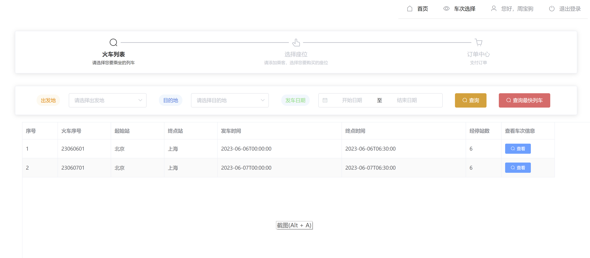
3. 点中某一辆列车，进入到选座页面：在该页面会显示当前车次的信息（如余票数量和票类价格），每趟列车包含30个经济座、10个商务座、10个头等座，不可选的座位会显示为灰色；
用户首先需选择当前购票乘客，并可通过“添加乘客信息”来增添乘客。只有当用户选择购票乘客后方可点击座位进行购票，在购票后可以选择完成购票进入订单中心，也可选择继续为他人购票；
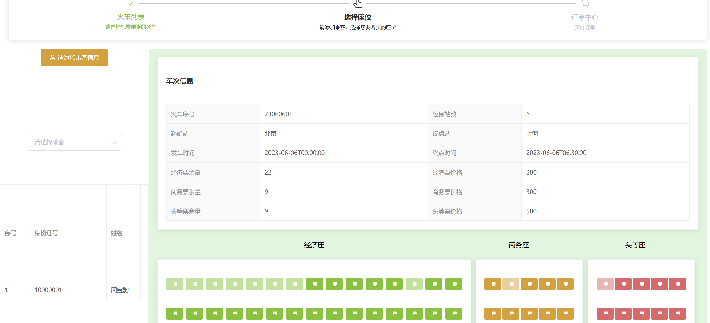
4. （拓展）在成功选座预订完毕后，会向该乘客的邮箱发送提示信息：

5. 在完成选座后跳转至订单信息中的“当前订单”页面，会显示当前未支付的订单；用户可以选择“支付订单”，跳转到支付页面，同时也可“取消订单”使订单进入到失效订单列表中；在支付成功后，订单会从未支付订单列表进入到已支付订单中；
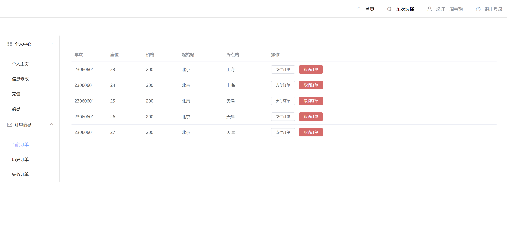
6. 在支付页面，用户可点击“微信支付”，支付当前订单：
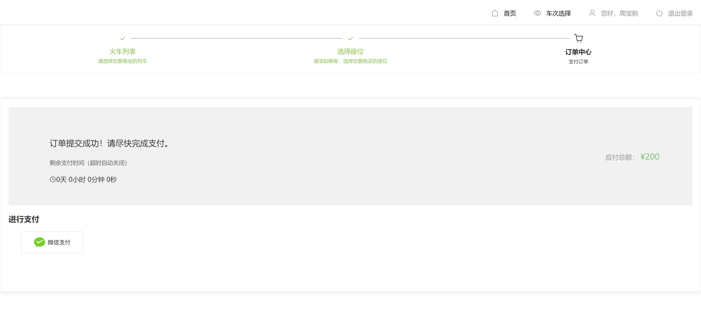
7. 在已支付订单列表中，用户还可以实现订单改签功能，该功能会自动跳转到火车列表页面，并显示所有满足该订单对应车辆的出发站和目的地，且发车时间晚于该车辆的所有列车；用户可以继续进行选择列车、选择座位购票等功能；
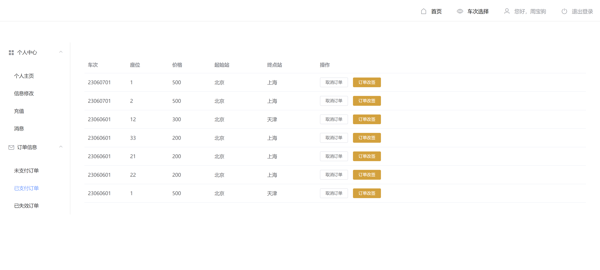
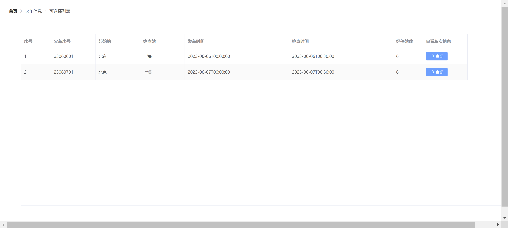
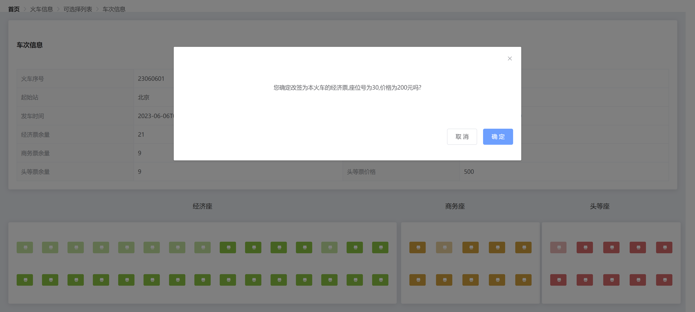
8. 在个人中心页面包含个人主页、信息修改、充值、消息四个功能；
其中个人主页展示了用户的基本信息：
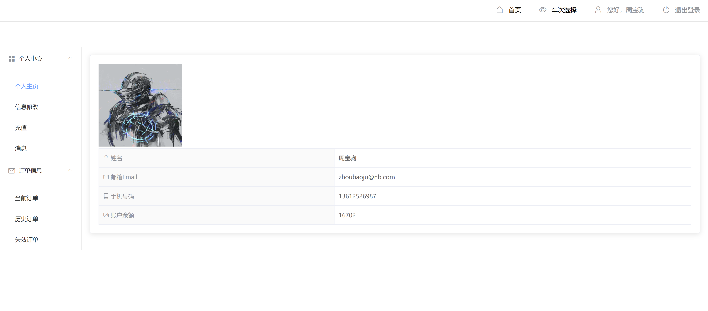
在信息修改页面，用户可以对基本信息进行修改：

在充值页面，用户可以选择五种金额进行充值，便于购票：

最后在消息页面，会显示用户成功购票后的提示信息：
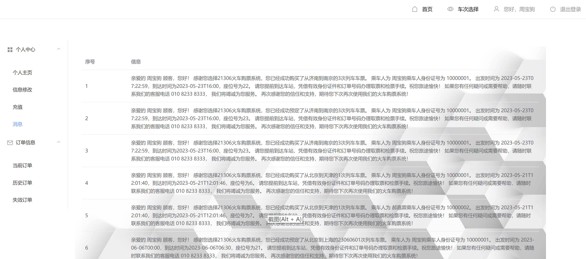
#### 4.2.4.铁路管理员（需先进行登录）
1. 在登录时选择铁路管理员身份后，进入到铁路管理员主页面;
在该页面，管理员可以添加列车、查询某辆列车、编辑列车和删除列车：
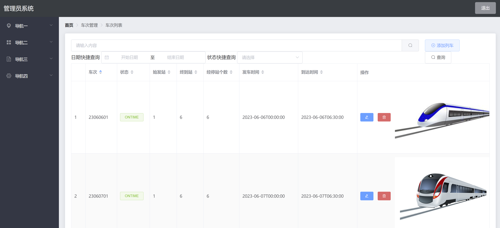
2. 在编辑列车信息时，除可以修改列车基本信息外，还可以编辑座位信息和经停站信息：
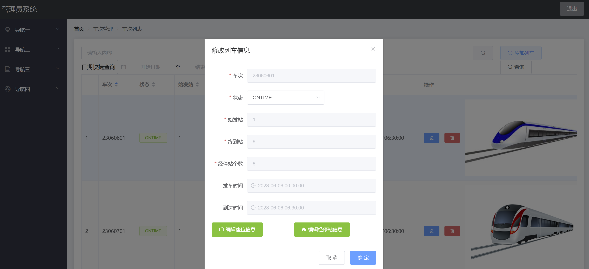
3. 座位信息页面：
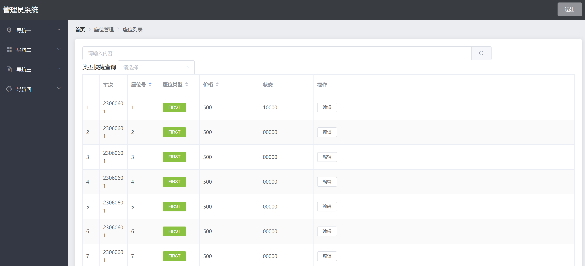
编辑座位信息，可以修改座位类型和价格：
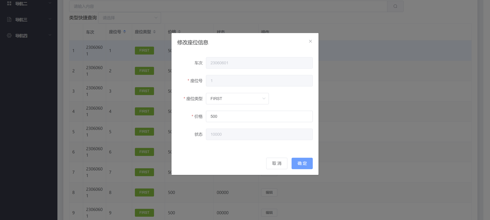
4. 经停站信息页面：
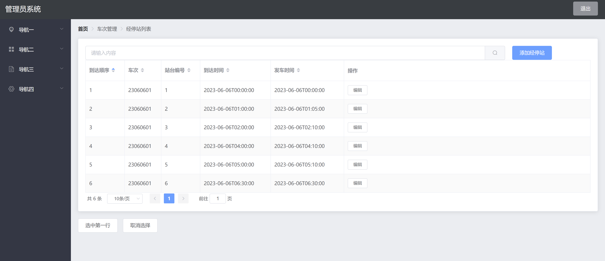
编辑经停站信息，可修改经停站地和到达、发车时间：
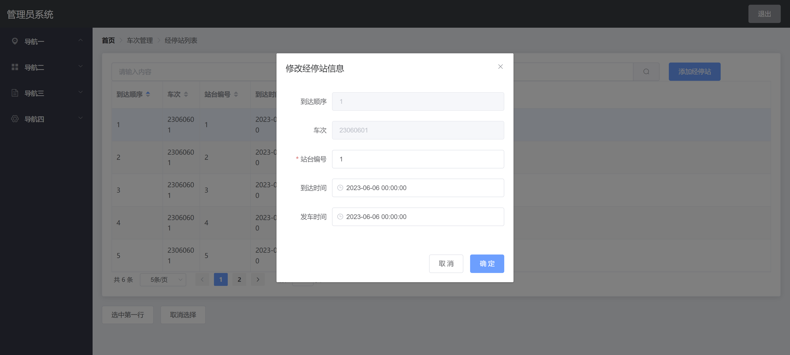
#### 4.2.5.系统管理员（需先进行登录）
1. 在登录时选择系统管理员身份后，进入到系统管理员主页面；
在该页面，管理员可以进行添加用户、编辑用户信息、删除该用户三个功能：
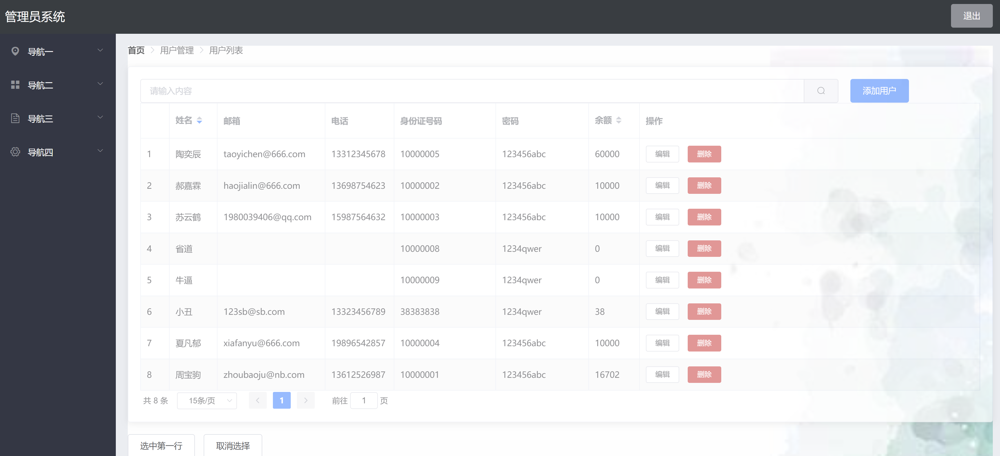
2. 系统管理员可以选择任一用户，并修改该用户信息：
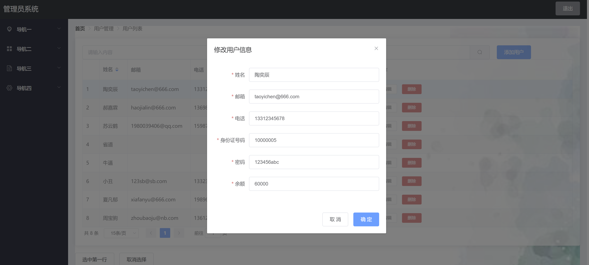
### 4.3 出错和恢复

1. 游客在尝试查看火车详细信息并购票时，会强制跳转到登录页面；

2. 用户在注册时，会对身份信息进行合法性判断，用户需填写合法的身份证号和密码；

3. 用户在点击购票时，若未填写查询要求，则无法进行“查询最快列车”功能；

4. 用户在选座位时需先选中当前购票乘客，同时一位乘客只可购买一张票；

5. 用户在添加乘客时，需保证添加乘客的信息合法；

